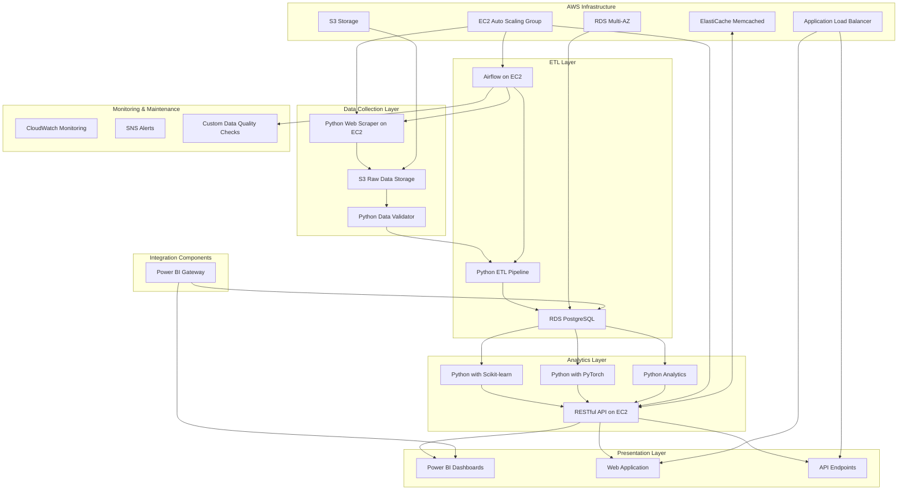
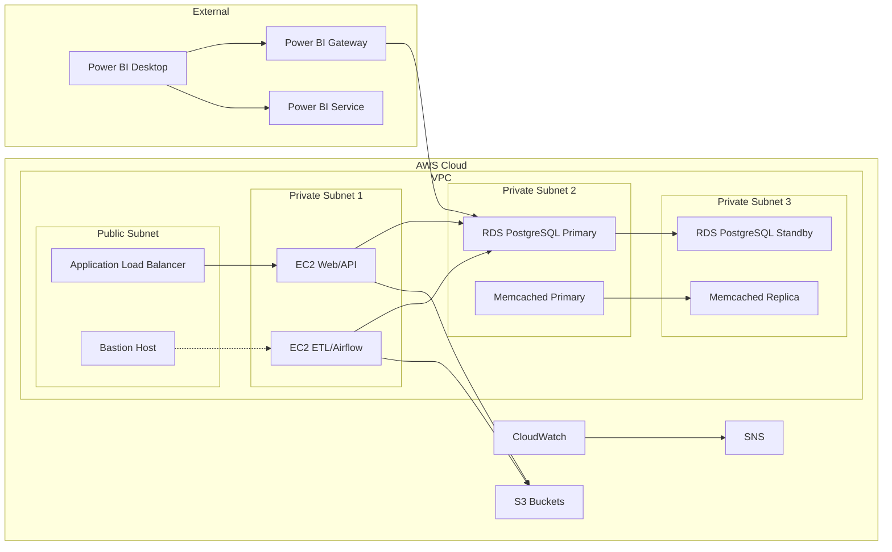

# NBA Fantasy Analytics Platform: 架构设计

## 摘要

NBA Fantasy Analytics Platform旨在为Fantasy篮球玩家提供数据驱动的决策支持工具。本架构设计基于以下关键目标和设计决策：

- **端到端数据流**: 从数据采集、ETL处理、高级分析到可视化呈现的完整流程
- **可伸缩性**: 利用AWS云服务提供灵活、可伸缩的部署选项
- **分析能力**: 整合机器学习和数据挖掘技术提供预测和优化功能
- **技能展示**: 选择符合就业市场需求的技术栈(Python, PostgreSQL, PyTorch, Power BI)
- **实用性**: 直接针对Fantasy篮球场景的具体问题提供解决方案

本文档描述了NBA Fantasy Analytics Platform的整体架构设计，包括系统组件、技术选择和部署模型的高层概述。详细的设计内容在各专项文档中进一步展开。

## 1. 系统架构概览

NBA Fantasy Analytics Platform是一个端到端的数据分析平台，从NBA数据采集、处理到分析预测和可视化呈现。系统采用分层架构，每层具有明确的职责和界面。

> **注意**: 详细的数据流程和ETL管道设计请参阅 [ETL Pipeline文档](2-ETL-Pipeline.md)。

## 2. 系统层次架构

### 2.1 数据采集层 (Data Collection Layer)
- **目的**: 从多个数据源采集NBA数据
- **组件**:
  - Python Web爬虫 (在EC2上运行)
  - S3原始数据存储
  - Python数据验证器
- **技术**:
  - Python (`requests`, `BeautifulSoup`)
  - AWS S3
  - 数据验证库 (`pydantic`)

### 2.2 ETL层 (ETL Layer)
- **目的**: 转换原始数据为结构化分析数据
- **组件**:
  - Python ETL流程
  - 关系型数据库 (PostgreSQL)
  - Airflow编排
- **技术**:
  - Python (`pandas`, `numpy`)
  - AWS RDS (PostgreSQL)
  - SQLAlchemy ORM
  - Apache Airflow

### 2.3 分析层 (Analytics Layer)
- **目的**: 实现预测和高级分析功能
- **组件**:
  - 机器学习模型 (Scikit-learn)
  - 深度学习模型 (PyTorch)
  - RESTful API服务
- **技术**:
  - Python (`scikit-learn`, `pytorch`)
  - `FastAPI`
  - AWS EC2

### 2.4 展示层 (Presentation Layer)
- **目的**: 向用户呈现分析结果和洞察
- **组件**:
  - Power BI仪表板
  - Web应用界面
  - API端点
- **技术**:
  - Power BI
  - React前端
  - REST API

## 3. 技术栈选择

系统采用以下核心技术栈，详细的技术选择理由、替代方案分析和具体实施细节请参阅 [技术栈决策文档](6-tech-stack-decisions.md)。

| 类别 | 技术选择 |
|------|----------|
| 数据库 | PostgreSQL |
| ORM层 | SQLAlchemy |
| 后端语言 | Python |
| ETL工具 | Apache Airflow |
| API框架 | FastAPI |
| 机器学习框架 | Scikit-learn, PyTorch |
| 可视化工具 | Power BI |
| 前端框架 | React |
| 云平台 | AWS |
| 缓存 | Memcached |
| 容器化 | Docker & Docker Compose |
| CI/CD | GitHub Actions |

主要AWS服务使用:
- EC2: 计算资源
- RDS: PostgreSQL数据库
- S3: 数据存储
- ElastiCache: Memcached缓存
- ALB: 负载均衡
- CloudWatch: 监控和告警

## 4. 部署架构

系统采用AWS云服务进行部署，利用其高可用性和弹性扩展能力。关于容器化和部署的详细策略请参阅 [运维策略文档](5-operations.md)。

### 4.1 网络架构

- VPC隔离不同环境
- 公共子网用于ALB和面向用户的组件
- 私有子网用于数据库和内部服务
- 安全组控制访问规则

### 4.2 EC2部署模型

- Auto Scaling组确保可用性和性能
- 多可用区部署提高容错性
- 镜像和启动配置标准化部署

### 4.3 数据存储架构

- S3用于原始数据和非结构化数据
- RDS用于结构化分析数据
- ElastiCache用于频繁访问数据缓存

### 4.4 Power BI集成

- Power BI Gateway连接AWS RDS PostgreSQL数据源
- 直接查询模式与导入模式选择
- 共享服务和发布策略

### 4.5 部署总览图

## 5. 服务通信

### 5.1 通信模式

- REST API作为主要服务通信方式
- S3对象存储用于大型数据传输
- Memcached用于服务间缓存数据共享

### 5.2 API设计

API采用RESTful设计原则，遵循以下规范：
- 基于OpenAPI 3.0规范
- 资源导向的端点结构
- 版本控制策略: URL路径版本(如 `/api/v1/`)
- 标准化响应格式
- JSON数据交换格式
- JWT认证机制

主要端点类别：
- 球员数据端点
- 比赛数据端点
- 统计和预测端点
- Fantasy优化端点

> **注意**: 详细的API设计和端点规范在API文档中提供。

## 6. 扩展性设计

### 6.1 垂直扩展
- EC2实例类型升级
- RDS实例扩容
- ElastiCache节点扩容

### 6.2 水平扩展
- EC2 Auto Scaling组
- 读写分离 (RDS Read Replicas)
- Memcached节点扩容

### 6.3 功能扩展
- 模块化设计便于添加新功能
- 插件架构支持分析模型扩展
- API版本控制支持兼容性

## 7. 性能优化策略

系统采用多层次性能优化策略：

1. **数据库优化**: 
   - 索引设计和查询优化
   - 物化视图加速复杂查询
   - 适当的分区策略
   
   > 详见 [数据模型文档](3-database-schema.md) 中的性能优化章节

2. **缓存策略**:
   - 多层次缓存架构
   - API响应缓存
   - 预计算结果缓存
   
   > 详见 [缓存策略文档](4-caching-strategy.md)

3. **计算优化**:
   - 批处理优化
   - 并行计算
   - 资源分配优化

## 8. 安全考虑

系统实施全面的安全策略，包括：

1. **数据安全**:
   - 静态加密 (S3, RDS)
   - 传输加密 (HTTPS/TLS)
   - 访问控制和审计

2. **身份验证和授权**:
   - 多因素认证
   - 基于角色的访问控制
   - 最小权限原则

3. **网络安全**:
   - VPC隔离
   - 安全组限制流量
   - WAF保护Web应用

> 详细的安全实施请参阅 [运维策略文档](5-operations.md) 中的安全章节。

## 9. 系统限制与约束

### 9.1 性能限制
- 数据刷新频率: 球员数据最快每小时更新一次
- 响应时间要求: API请求 < 200ms (95%); 复杂分析查询 < 3秒
- 并发用户: 设计支持最多1000个并发用户

### 9.2 技术约束
- 数据源限制: 依赖公开可用数据
- AWS资源限制: 根据预算约束选择实例类型
- 计划外维护窗口: 系统每月可能需要2小时维护时间

## 10. 与其他子系统的关系

本架构文档提供了系统的整体视图，与其他专项文档的关系如下：

- **[ETL Pipeline文档](2-ETL-Pipeline.md)**: 详细说明数据采集和处理流程
- **[数据模型文档](3-database-schema.md)**: 详细设计数据库模式和关系
- **[缓存策略文档](4-caching-strategy.md)**: 详细说明多层缓存实施方案
- **[运维策略文档](5-operations.md)**: 详细描述部署、监控和运维流程
- **[技术栈决策文档](6-tech-stack-decisions.md)**: 详细说明技术选择理由
- **[实施路线图](7-implementation-roadmap.md)**: 详细规划开发和部署时间线

## 11. 结论

NBA Fantasy Analytics Platform的架构设计提供了一个全面、可扩展的Fantasy篮球分析解决方案框架。通过分层架构和模块化设计，系统能够有效地处理数据采集、转换、预测分析和可视化呈现的整个流程。选择的技术栈满足了性能需求，同时为未来的扩展和优化提供了灵活性。

该系统基于AWS云服务构建，利用其高可用性和弹性扩展能力，结合合理的安全措施和性能优化策略，确保了系统的可靠性和可维护性。虽然受到一定的技术和成本约束，但通过明确的演进路径，系统可以逐步扩展功能和提高性能，以满足不断变化的用户需求。
