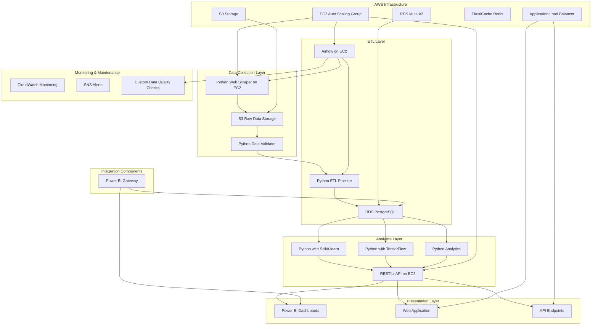
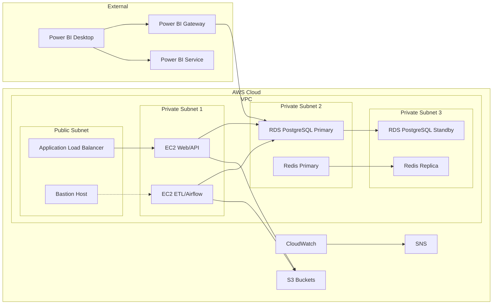

# NBA Fantasy Analytics Platform: 架构设计

## 摘要

NBA Fantasy Analytics Platform旨在为Fantasy篮球玩家提供数据驱动的决策支持工具。本架构设计基于以下关键目标和设计决策：

- **端到端数据流**: 从数据采集、ETL处理、高级分析到可视化呈现的完整流程
- **可伸缩性**: 利用AWS云服务提供灵活、可伸缩的部署选项
- **分析能力**: 整合机器学习和数据挖掘技术提供预测和优化功能
- **技能展示**: 选择符合就业市场需求的技术栈(Python, SQL, Power BI)
- **实用性**: 直接针对Fantasy篮球场景的具体问题提供解决方案

本文档描述了NBA Fantasy Analytics Platform的整体架构设计，包括系统组件、技术选择和部署模型。

## 1. 系统架构概览

NBA Fantasy Analytics Platform是一个端到端的数据分析平台，从NBA数据采集、处理到分析预测和可视化呈现。系统采用分层架构，每层具有明确的职责和界面。



## 2. 系统层次架构

### 2.1 数据采集层 (Data Collection Layer)
- **目的**: 从多个数据源采集NBA数据
- **组件**:
  - Python Web爬虫 (在EC2上运行)
  - S3原始数据存储
  - Python数据验证器
- **技术**:
  - Python (`requests`, `BeautifulSoup`)
  - AWS S3
  - 数据验证库 (`pydantic`)

### 2.2 ETL层 (ETL Layer)
- **目的**: 转换原始数据为结构化分析数据
- **组件**:
  - Python ETL流程
  - 关系型数据库 (PostgreSQL)
  - Airflow编排
- **技术**:
  - Python (`pandas`, `numpy`)
  - AWS RDS (PostgreSQL)
  - SQLAlchemy ORM
  - Apache Airflow

### 2.3 分析层 (Analytics Layer)
- **目的**: 实现预测和高级分析功能
- **组件**:
  - 机器学习模型 (Scikit-learn)
  - 深度学习模型 (TensorFlow)
  - RESTful API服务
- **技术**:
  - Python (`scikit-learn`, `tensorflow`)
  - `FastAPI`/`Flask`
  - AWS EC2

### 2.4 展示层 (Presentation Layer)
- **目的**: 向用户呈现分析结果和洞察
- **组件**:
  - Power BI仪表板
  - Web应用界面
  - API端点
- **技术**:
  - Power BI
  - React/Angular前端
  - REST API

## 3. 技术栈选择

### 3.1 核心技术栈

| 组件 | 技术选择 | 选择理由 |
|------|----------|----------|
| 数据库 | PostgreSQL | 强大的分析功能，开源免费，优秀的扩展性和JSON支持 |
| ORM层 | SQLAlchemy | Python标准ORM，强大的查询构建和会话管理，完善的PostgreSQL特性支持 |
| ETL工具 | Python (pandas, numpy) | 灵活性高，广泛应用于数据工程领域 |
| 机器学习 | Scikit-learn, TensorFlow | 行业标准ML库，适合不同复杂度的模型 |
| 可视化 | Power BI | 强大的BI工具，符合求职技能要求 |
| 编排 | Airflow | 行业标准的工作流编排工具 |
| API | FastAPI | 现代、高性能的Python API框架 |
| 前端 | React | 灵活的前端框架 |
| 云平台 | AWS | 广泛使用的云服务提供商 |

### 3.2 AWS服务选择

| 需求 | AWS服务 | 用途 |
|------|---------|------|
| 计算 | EC2 | 运行爬虫、ETL和API服务 |
| 存储 | S3 | 存储原始数据和中间结果 |
| 数据库 | RDS | 托管PostgreSQL数据库 |
| 缓存 | ElastiCache | Redis缓存层 |
| 负载均衡 | ALB | Web应用和API负载均衡 |
| 监控 | CloudWatch | 服务监控和警报 |
| 消息 | SNS | 警报通知 |
| 计划任务 | EventBridge | 触发计划任务 |

## 4. 部署架构

系统采用AWS云服务进行部署，利用其高可用性和弹性扩展能力。

### 4.1 网络架构

- VPC隔离不同环境
- 公共子网用于ALB和面向用户的组件
- 私有子网用于数据库和内部服务
- 安全组控制访问规则

### 4.2 EC2部署模型

- Auto Scaling组确保可用性和性能
- 多可用区部署提高容错性
- 镜像和启动配置标准化部署

### 4.3 数据存储架构

- S3用于原始数据和非结构化数据
- RDS用于结构化分析数据
- ElastiCache用于频繁访问数据缓存

### 4.4 Power BI集成

- Power BI Gateway连接AWS RDS PostgreSQL数据源
- 直接查询模式与导入模式选择
- 共享服务和发布策略

#### 4.4.1 PostgreSQL与Power BI连接配置

- **驱动程序要求**：安装并配置PostgreSQL的ODBC驱动程序（推荐使用官方psqlODBC驱动程序）
- **连接字符串示例**：
  ```
  Driver={PostgreSQL Unicode};Server=your-rds-endpoint.rds.amazonaws.com;Port=5432;Database=nba_fantasy;Uid=username;Pwd=password;
  ```
- **连接优化**：
  - 配置适当的连接池大小和查询超时
  - 使用SSL加密传输以保证安全性
  - 为Power BI创建只读用户角色，遵循最小权限原则
- **使用考虑**：
  - DirectQuery模式适用于实时数据需求，但可能影响性能
  - 导入模式适用于较静态的报表，提供更好的交互性能
  - 使用压缩查询功能减少数据传输量



## 5. 服务通信

### 5.1 通信模式

- REST API作为主要服务通信方式
- S3对象存储用于大型数据传输
- Redis用于服务间缓存数据共享

### 5.2 API设计

#### 5.2.1 API规范
- 基于OpenAPI 3.0规范定义API接口，支持自动生成API文档
- RESTful设计原则，资源导向的端点结构
- 版本控制策略: URL路径版本(如 `/api/v1/`)，确保向后兼容性
- 标准化响应格式:
  ```json
  {
    "status": "success|error",
    "data": { /* 响应数据 */ },
    "error": { "code": "ERROR_CODE", "message": "错误描述" },
    "meta": { "pagination": {"total": 100, "page": 1, "per_page": 20}, "processing_time": 0.023 }
  }
  ```
- JSON作为数据交换格式
- JWT认证机制，支持基于角色的访问控制

#### 5.2.2 主要端点
| 端点 | 方法 | 描述 | 参数 |
|------|------|------|------|
| /api/v1/players | GET | 获取球员列表 | team, position, season, sort, limit, page |
| /api/v1/players/{id} | GET | 获取单个球员详情 | stats, projections, history, injuries |
| /api/v1/players/{id}/stats | GET | 获取球员统计数据 | season, last_n_games, home_away |
| /api/v1/teams | GET | 获取球队列表 | conference, division, season |
| /api/v1/teams/{id}/players | GET | 获取球队球员列表 | active, position, stats |
| /api/v1/games | GET | 获取比赛列表 | date_range, team, season |
| /api/v1/games/{id}/stats | GET | 获取比赛统计数据 | player_stats, team_stats |
| /api/v1/projections | GET | 获取预测数据 | player_id, date_range, projection_type |
| /api/v1/fantasy/optimal-lineup | POST | 生成最优阵容 | scoring_rules, constraints, available_players |
| /api/v1/fantasy/matchups | GET | 获取对阵优势分析 | team_id, opponent_id, date |

#### 5.2.3 扩展性与集成
- 支持批量操作 (Batch Requests)
- 提供Webhook用于事件通知 (比如球员伤病更新)
- 支持API Key认证用于第三方集成
- 提供GraphQL端点作为REST API的替代选项，支持复杂查询

### 5.3 权限控制

- 基于IAM角色的服务访问控制
- 基于策略的API授权
- 资源级权限管理

## 6. 扩展性设计

### 6.1 垂直扩展

- EC2实例类型升级
- RDS实例扩容
- ElastiCache节点扩容

### 6.2 水平扩展

- EC2 Auto Scaling组
- 读写分离 (RDS Read Replicas)
- 分片策略考虑

### 6.3 功能扩展

- 模块化设计便于添加新功能
- 插件架构支持分析模型扩展
- API版本控制支持兼容性

## 7. 性能优化

### 7.1 数据库优化

#### 7.1.1 PostgreSQL特有优化策略
- **VACUUM操作计划**：
  - 配置autovacuum以自动清理死元组
  - 对大型表设置定制VACUUM计划，避免性能下降
  - 定期执行VACUUM ANALYZE保持统计信息更新
- **PostgreSQL特有索引类型**：
  - GIN索引：用于全文搜索和复杂JSON查询
  - GiST索引：适用于地理数据和复杂数据类型
  - BRIN索引：适用于大型表上顺序数据的低开销索引
  - 部分索引：针对常用过滤条件优化性能
- **查询优化**：
  - 使用EXPLAIN ANALYZE分析和优化查询计划
  - 配置effective_cache_size和work_mem参数调整查询性能
  - 使用并行查询功能加速大型数据集处理
- **表分区**：
  - 使用PostgreSQL声明式分区实现大表的高效管理
  - 按日期范围分区时间序列数据（如比赛统计）

#### 7.1.2 常规优化策略
- 索引设计优化查询性能
- 物化视图加速复杂查询
- 统计信息收集和维护

### 7.2 缓存策略

- 应用层缓存减少数据库负载
- API响应缓存提高响应速度
- 查询结果缓存避免重复计算

### 7.3 计算优化

- 批处理优化ETL性能
- 并行处理利用多核资源
- 资源分配匹配工作负载

## 8. 安全考虑

### 8.1 数据安全

- 静态加密 (S3, RDS)
- 传输加密 (HTTPS/TLS)
- 访问控制和审计

### 8.2 身份验证和授权

- 多因素认证
- 基于角色的访问控制
- 最小权限原则

### 8.3 网络安全

- VPC隔离
- 安全组限制流量
- WAF保护Web应用

## 9. 运维考虑

### 9.1 监控和告警

详见 [operations.md](operations.md) 文档中的监控与告警部分。

### 9.2 部署和CI/CD

- 持续集成/持续部署流程
- 基础设施即代码 (Terraform/CloudFormation)
- 蓝绿部署和回滚策略

### 9.3 容灾和备份

详见 [operations.md](operations.md) 文档中的高可用架构部分。

## 10. 系统限制与约束

### 10.1 性能限制

- **数据刷新频率**: 球员数据最快每小时更新一次，实时比分不在MVP范围内
- **响应时间要求**: 
  - API请求: 95%的请求 < 200ms
  - 复杂分析查询: < 3秒
  - 预测模型生成: < 10秒
- **并发用户**: 设计支持最多1000个并发用户
- **数据规模**:
  - 球员历史数据: ~500MB
  - 比赛数据: ~5GB/赛季
  - 总存储需求: < 50GB (不含备份)

### 10.2 技术约束

- **数据源限制**: 依赖公开可用数据，遵守Basketball-Reference的robots.txt规则
- **AWS资源限制**: 根据成本考虑，使用t3.medium及以下实例类型
- **Power BI限制**: 使用Power BI Pro版本，受限于8GB数据集大小
- **计划外维护窗口**: 系统每月可能需要2小时维护时间

### 10.3 合规与法律约束

- **数据使用**: 确保遵守数据源的使用条款，仅用于个人和教育目的
- **用户数据**: 实施适当的用户数据保护措施，符合基本隐私规定
- **第三方API**: 受限于第三方API的使用限制和费率限制

### 10.4 成本约束

- **总体预算**: AWS资源月度预算控制在$200以内
- **成本优化**: 非高峰期自动缩减资源，使用保留实例降低成本
- **存储策略**: 冷数据迁移到更低成本存储级别
