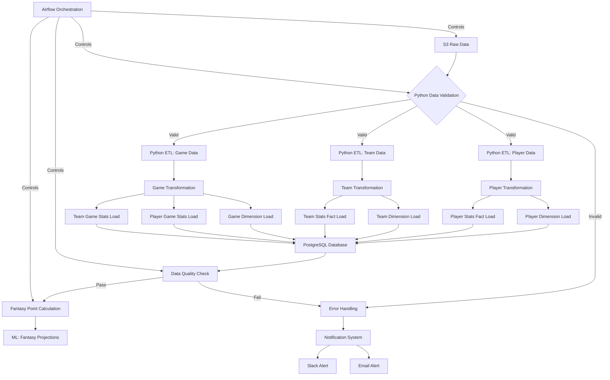
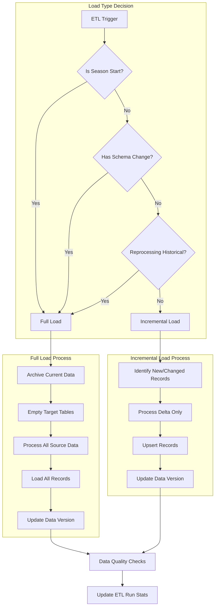

# NBA Fantasy Analytics Platform: ETL Pipeline

## 执行摘要

本ETL流程设计旨在构建一个高效、可靠的数据处理系统，将NBA原始数据转换为Fantasy分析所需的结构化格式。设计关注以下核心目标：

- **数据完整性**: 保证数据在采集、转换和加载过程中的准确性和一致性
- **流程自动化**: 通过Airflow实现全流程自动化调度和监控
- **可扩展性**: 支持新数据源和指标的轻松添加
- **质量保证**: 内置数据验证和质量检查机制
- **可追溯性**: 跟踪数据来源和转换历史

本文档详细描述了NBA Fantasy Analytics Platform的ETL (Extract, Transform, Load) 流程，专注于使用Python作为主要ETL工具，PostgreSQL作为数据库，以及SQLAlchemy作为ORM层。本文档是[架构设计](1-architecture.md)的具体实现部分，负责详细说明数据采集、转换和加载的过程。

> **文档关系**: 本ETL文档是[架构设计](1-architecture.md)中提到的数据采集层和ETL层的详细实现说明。技术选择的理由详见[技术栈决策文档](6-tech-stack-decisions.md)，数据库结构的详细设计见[数据模型文档](3-database-schema.md)。

## 1. ETL流程概览

ETL流程包括从原始数据源提取NBA数据，转换为分析友好的格式，并加载到PostgreSQL数据仓库中，支持后续的分析和预测功能。



## 2. 数据提取 (Extract)

### 2.1 数据源
- Basketball-Reference.com (主要来源)
- 可选的NBA API数据来源
- 历史数据集导入

### 2.2 提取方法
- **Python Web Scraping**: 使用 `requests` 和 `BeautifulSoup` 实现
- **速率限制**: 遵循爬虫延迟，避免影响源网站
- **增量提取**: 仅获取新数据或已更新数据

### 2.3 提取代码示例

```python
def extract_player_data(player_id):
    """提取单个球员的数据"""
    url = f"https://www.basketball-reference.com/players/{player_id[0]}/{player_id}.html"
    headers = {'User-Agent': SCRAPER_USER_AGENT}
    
    # 实施速率限制
    time.sleep(RATE_LIMIT)
    
    try:
        response = requests.get(url, headers=headers)
        response.raise_for_status()
        
        # 解析HTML
        soup = BeautifulSoup(response.text, 'html.parser')
        
        # 提取数据表格
        per_game_table = soup.find('table', {'id': 'per_game'})
        if not per_game_table:
            return None
            
        # 转换为DataFrame
        data = pd.read_html(str(per_game_table))[0]
        
        # 保存原始数据到S3
        s3_path = f"raw/players/{player_id}/{datetime.now().strftime('%Y%m%d')}.json"
        save_to_s3(data.to_json(), s3_path)
        
        return data
    except Exception as e:
        log_error(f"提取错误: {player_id}: {str(e)}")
        return None
```

## 3. 数据转换 (Transform)

### 3.1 转换操作
- **数据清洗**: 处理缺失值、异常值和格式不一致
- **数据标准化**: 统一单位、命名和时间格式
- **数据增强**: 计算附加指标和统计数据
- **维度建模**: 构建星型模式用于分析

> **注意**: 关于星型模式的详细数据库设计，请参考[数据模型文档](3-database-schema.md)。

### 3.2 转换流程
1. **球员数据转换**:
   - 基本信息提取到dimension表
   - 统计数据分解为各种fact表
   - 生成历史趋势和比较指标

2. **球队数据转换**:
   - 球队基本信息到dimension表
   - 球队统计数据到fact表
   - 计算球队实力指标

3. **比赛数据转换**:
   - 比赛元数据到dimension表
   - 球员比赛表现到fact表
   - 计算比赛因素和上下文

### 3.3 转换代码示例

```python
def transform_player_stats(raw_data, player_id):
    """转换球员统计数据"""
    # 创建数据副本
    df = raw_data.copy()
    
    # 清洗和转换
    df = df[df['Season'] != 'Career']  # 移除Career行
    df['Season'] = df['Season'].str.replace('-', '_')  # 标准化季节格式
    
    # 转换数值列
    numeric_cols = ['PTS', 'TRB', 'AST', 'STL', 'BLK', 'TOV', 'PF', 'FG%', '3P%', 'FT%']
    for col in numeric_cols:
        if col in df.columns:
            df[col] = pd.to_numeric(df[col], errors='coerce')
    
    # 计算附加指标
    if all(x in df.columns for x in ['PTS', 'FGA', 'FTA']):
        df['TS%'] = df['PTS'] / (2 * (df['FGA'] + 0.44 * df['FTA']))
    
    # 计算Fantasy Points (基本ESPN标准)
    df['Fantasy_Points'] = (
        df['PTS'] * 1.0 + 
        df['TRB'] * 1.2 + 
        df['AST'] * 1.5 + 
        df['STL'] * 3.0 + 
        df['BLK'] * 3.0 + 
        df['TOV'] * -1.0
    )
    
    # 准备维度和事实表数据
    dim_data = {
        'player_id': player_id,
        'player_name': get_player_name(raw_data),
        'position': get_player_position(raw_data),
        'data_source': 'basketball-reference',
        'updated_at': datetime.now()
    }
    
    fact_data = []
    for _, row in df.iterrows():
        fact_data.append({
            'player_id': player_id,
            'season': row['Season'],
            'team': row['Tm'],
            'games_played': row['G'],
            'minutes_per_game': row['MP'],
            'points_per_game': row['PTS'],
            'rebounds_per_game': row['TRB'],
            'assists_per_game': row['AST'],
            'steals_per_game': row['STL'],
            'blocks_per_game': row['BLK'],
            'turnovers_per_game': row['TOV'],
            'fg_percentage': row['FG%'],
            'true_shooting_pct': row.get('TS%', None),
            'fantasy_points': row['Fantasy_Points']
        })
    
    return dim_data, fact_data
```

## 4. 数据加载 (Load)

### 4.1 加载策略
- **增量加载**: 仅更新变化的数据
- **全量刷新**: 适用于较小维度表和季度开始
- **批量加载**: 使用批处理提高性能
- **数据版本控制**: 跟踪每次加载的版本

### 4.2 加载流程



### 4.3 数据加载代码示例

#### 4.3.1 使用原生SQL的PostgreSQL UPSERT示例

```python
def load_player_dimension(dim_data, conn):
    """加载球员维度数据"""
    cursor = conn.cursor()
    
    # 使用UPSERT模式 (插入或更新) - PostgreSQL语法
    sql = """
    INSERT INTO dim_players 
        (player_external_id, first_name, last_name, position, data_source, created_at, updated_at)
    VALUES 
        (%(player_id)s, %(first_name)s, %(last_name)s, %(position)s, %(data_source)s, NOW(), NOW())
    ON CONFLICT (player_external_id) 
    DO UPDATE SET
        position = EXCLUDED.position,
        data_source = EXCLUDED.data_source,
        updated_at = NOW();
    """
    
    # 执行SQL
    cursor.execute(sql, dim_data)
    
    # 获取插入/更新的ID
    cursor.execute("SELECT player_id FROM dim_players WHERE player_external_id = %s", 
                 (dim_data['player_id'],))
    internal_id = cursor.fetchone()[0]
    
    # 记录ETL运行统计
    log_etl_stat("load_player_dimension", "success", 1, conn)
    
    return internal_id
```

#### 4.3.2 使用SQLAlchemy ORM的加载示例

```python
from sqlalchemy import create_engine, Column, Integer, String, DateTime, Float, func
from sqlalchemy.ext.declarative import declarative_base
from sqlalchemy.orm import Session
from sqlalchemy.dialects.postgresql import insert

Base = declarative_base()

class DimPlayers(Base):
    """球员维度表ORM模型"""
    __tablename__ = 'dim_players'
    
    player_id = Column(Integer, primary_key=True)
    player_external_id = Column(String, unique=True, nullable=False)
    first_name = Column(String, nullable=False)
    last_name = Column(String, nullable=False)
    position = Column(String)
    data_source = Column(String)
    created_at = Column(DateTime, default=func.now())
    updated_at = Column(DateTime, default=func.now(), onupdate=func.now())

class ETLRunStats(Base):
    """ETL运行统计表ORM模型"""
    __tablename__ = 'etl_run_stats'
    
    run_id = Column(Integer, primary_key=True)
    process_name = Column(String, nullable=False)
    status = Column(String, nullable=False)
    records_processed = Column(Integer, default=0)
    error_details = Column(String)
    created_at = Column(DateTime, default=func.now())

def load_player_dimension_sqlalchemy(dim_data, db_session: Session):
    """使用SQLAlchemy加载球员维度数据"""

    # 创建插入语句
    stmt = insert(DimPlayers).values(
        player_external_id=dim_data['player_id'],
        first_name=dim_data['first_name'],
        last_name=dim_data['last_name'],
        position=dim_data['position'],
        data_source=dim_data['data_source'],
        created_at=func.now(),
        updated_at=func.now()
    )

    # 定义UPSERT行为 (PostgreSQL的ON CONFLICT)
    stmt = stmt.on_conflict_do_update(
        index_elements=['player_external_id'],
        set_={
            'position': stmt.excluded.position,
            'data_source': stmt.excluded.data_source,
            'updated_at': func.now()
        }
    )

    # 执行语句
    result = db_session.execute(stmt)
    db_session.commit()

    # 获取插入/更新的ID
    player_id = db_session.query(DimPlayers.player_id).filter(
        DimPlayers.player_external_id == dim_data['player_id']
    ).scalar()

    # 记录ETL运行统计
    log_etl_stat("load_player_dimension", "success", 1, db_session)

    return player_id

def log_etl_stat(process_name, status, records_processed, db_session, error_details=None):
    """记录ETL运行统计"""
    etl_stat = ETLRunStats(
        process_name=process_name,
        status=status,
        records_processed=records_processed,
        error_details=error_details
    )
    db_session.add(etl_stat)
    db_session.commit()
```

#### 4.3.3 SQLAlchemy批量加载优化

```python
def batch_insert_players(players_data, db_session):
    """使用SQLAlchemy批量插入优化性能"""
    try:
        # 预处理数据
        values_list = []
        for player in players_data:
            values_list.append({
                'player_external_id': player['player_id'],
                'first_name': player['first_name'],
                'last_name': player['last_name'],
                'position': player['position'],
                'data_source': player['data_source'],
                'created_at': func.now(),
                'updated_at': func.now()
            })
        
        # 批量插入
        if values_list:
            db_session.execute(insert(DimPlayers), values_list)
            db_session.commit()
            
            # 记录ETL运行统计
            log_etl_stat("batch_insert_players", "success", len(values_list), db_session)
            
        return len(values_list)
    
    except Exception as e:
        db_session.rollback()
        log_etl_stat("batch_insert_players", "error", 0, db_session, str(e))
        raise
```

## 5. 数据质量检查

### 5.1 质量检查类型
- **完整性检查**: 确保所有必要字段存在
- **一致性检查**: 验证跨表关系
- **正确性检查**: 验证数值范围和业务规则
- **及时性检查**: 验证数据是否为最新

### 5.2 失败处理
- 错误记录和分类
- 自动通知相关团队
- 根据严重性制定补救措施

### 5.3 数据质量规则示例

| 规则ID | 规则描述 | 严重性 | 应用对象 | 操作 |
|-------|---------|-------|---------|------|
| DQ001 | 球员名字不能为空 | 高 | dim_players | 拒绝记录 |
| DQ002 | 比赛得分必须为非负数 | 高 | fact_player_game_stats | 标记错误，设定为NULL |
| DQ003 | 球员统计数值在历史范围内 | 中 | fact_player_stats | 标记可疑，记录警告 |
| DQ004 | 数据时间戳晚于上次更新 | 高 | 所有表 | 拒绝过期数据 |
| DQ005 | 引用的维度ID必须存在 | 高 | 所有事实表 | 阻止加载，发出警报 |

```python
def validate_player_stats(stats_df):
    """验证球员统计数据的质量"""
    validation_results = {
        'passed': True,
        'errors': [],
        'warnings': []
    }
    
    # 检查1: 必填字段
    required_fields = ['player_id', 'season', 'points_per_game', 'games_played']
    for field in required_fields:
        if field not in stats_df.columns or stats_df[field].isna().any():
            validation_results['passed'] = False
            validation_results['errors'].append(f"必填字段缺失: {field}")
    
    # 检查2: 数值范围
    if 'points_per_game' in stats_df.columns:
        invalid_points = stats_df[stats_df['points_per_game'] < 0]
        if not invalid_points.empty:
            validation_results['passed'] = False
            validation_results['errors'].append(f"得分不能为负数: {len(invalid_points)}条记录")
    
    # 检查3: 统计异常
    if 'points_per_game' in stats_df.columns:
        outliers = stats_df[stats_df['points_per_game'] > 40]  # 超过40分/场视为可疑
        if not outliers.empty:
            validation_results['warnings'].append(f"得分异常高: {len(outliers)}条记录")
    
    return validation_results
```

### 5.4 使用SQLAlchemy进行数据质量检查

```python
def check_data_quality_with_sqlalchemy(db_session: Session):
    """使用SQLAlchemy执行数据库级别的质量检查"""
    quality_results = {
        'passed': True,
        'errors': [],
        'warnings': []
    }
    
    # 检查1: 球员名字不能为空
    missing_names = db_session.query(func.count(DimPlayers.player_id)).filter(
        or_(
            DimPlayers.first_name.is_(None),
            DimPlayers.first_name == '',
            DimPlayers.last_name.is_(None),
            DimPlayers.last_name == ''
        )
    ).scalar()
    
    if missing_names > 0:
        quality_results['passed'] = False
        quality_results['errors'].append(f"有{missing_names}名球员缺少姓名")
    
    # 检查2: 负得分检查
    negative_points = db_session.query(func.count(FactPlayerStats.stat_id)).filter(
        FactPlayerStats.points_per_game < 0
    ).scalar()
    
    if negative_points > 0:
        quality_results['passed'] = False
        quality_results['errors'].append(f"有{negative_points}条记录的得分为负值")
    
    return quality_results
```

## 6. 工作流编排

### 6.1 Airflow DAG设计
- 任务依赖关系管理
- 调度和触发机制
- 失败恢复和重试策略

### 6.2 使用Airflow与PostgreSQL和SQLAlchemy集成

```python
from airflow import DAG
from airflow.operators.python_operator import PythonOperator
from airflow.providers.postgres.operators.postgres import PostgresOperator
from airflow.providers.postgres.hooks.postgres import PostgresHook
from datetime import datetime, timedelta
from sqlalchemy import create_engine
from sqlalchemy.orm import sessionmaker

default_args = {
    'owner': 'airflow',
    'depends_on_past': False,
    'start_date': datetime(2023, 1, 1),
    'email_on_failure': True,
    'email_on_retry': False,
    'retries': 3,
    'retry_delay': timedelta(minutes=5)
}

dag = DAG(
    'nba_fantasy_etl',
    default_args=default_args,
    description='NBA Fantasy Analytics ETL Pipeline',
    schedule_interval='0 4 * * *',  # 每天凌晨4点运行
    catchup=False
)

# 使用PostgresOperator执行原生SQL
create_temp_table_task = PostgresOperator(
    task_id='create_temp_staging_table',
    postgres_conn_id='postgres_nba',
    sql="""
    CREATE TEMP TABLE IF NOT EXISTS player_stats_staging (
        player_external_id VARCHAR(50) NOT NULL,
        season VARCHAR(10) NOT NULL,
        points_per_game NUMERIC(5,2),
        PRIMARY KEY (player_external_id, season)
    )
    """,
    dag=dag
)

# 使用Python Operator结合SQLAlchemy
def process_with_sqlalchemy(**kwargs):
    # 获取PostgreSQL连接信息
    pg_hook = PostgresHook(postgres_conn_id='postgres_nba')
    engine = create_engine(pg_hook.get_uri())
    Session = sessionmaker(bind=engine)
    session = Session()
    
    try:
        # 执行ETL操作
        result = load_player_dimension_sqlalchemy(sample_data, session)
        return result
    finally:
        session.close()

sqlalchemy_task = PythonOperator(
    task_id='process_with_sqlalchemy',
    python_callable=process_with_sqlalchemy,
    provide_context=True,
    dag=dag
)

# 设置任务依赖
create_temp_table_task >> sqlalchemy_task
```

### 6.3 调度策略

#### 6.3.1 作业频率
| 数据类型 | 频率 | 时间窗口 | 理由 |
|---------|------|---------|------|
| 球员基本信息 | 每周一次 | 凌晨2:00 | 变化频率低 |
| 比赛结果 | 每日一次 | 凌晨4:00 | 每天更新 |
| 球员数据 | 每日一次 | 凌晨4:30 | 比赛后更新 |
| 伤病信息 | 每4小时一次 | 24小时 | 高时效性 |
| 历史数据 | 季度一次 | 周末凌晨 | 数据稳定，处理量大 |
| 数据质量审计 | 每周一次 | 周日凌晨 | 定期全面检查 |

#### 6.3.2 依赖关系管理
- 使用Airflow的TriggerDagRunOperator实现跨DAG依赖
- 实施数据就绪检查，确保上游数据可用
- 设置传感器(Sensors)监控文件到达和数据库更新
- 使用XCom在任务间传递元数据和处理状态

```python
# 实现数据就绪检查的示例
from airflow.sensors.sql_sensor import SqlSensor

data_ready_sensor = SqlSensor(
    task_id='check_player_data_ready',
    conn_id='postgres_conn',
    sql="""
    SELECT COUNT(*) > 0 
    FROM etl_run_stats 
    WHERE entity_type = 'player_data' 
    AND status = 'success' 
    AND start_time > CURRENT_DATE
    """,
    timeout=60 * 60,  # 1小时超时
    mode='reschedule',  # 不阻塞工作节点
    poke_interval=5 * 60,  # 每5分钟检查一次
    dag=dag
)

# 只有数据就绪后才继续处理任务
data_ready_sensor >> process_player_data_task
```

## 7. 监控与日志

### 7.1 ETL运行统计
- 每次ETL运行的详细记录
- 处理记录数、成功/失败率
- 执行时间和资源使用情况

### 7.2 PostgreSQL特有的监控指标
- VACUUM进程状态和效率
- 缓存命中率和表膨胀情况
- 长事务和锁等待
- 索引使用情况

> **注意**: 全面的系统监控策略请参阅[运维策略文档](5-operations.md)的"监控告警和日志管理"部分。

### 7.3 警报配置
- 触发条件和阈值
- 通知渠道和接收者
- 升级流程

### 7.4 数据血缘与治理

#### 7.4.1 数据血缘跟踪
- 记录每个数据点的来源和转换路径
- 维护字段级别的转换映射关系
- 使用元数据表记录数据流动和处理步骤
- 构建可视化数据血缘图

```python
def log_data_lineage(source_entity, target_entity, transformation_type, run_id, db_session):
    """记录数据血缘信息 - 使用SQLAlchemy"""
    
    lineage_record = DataLineage(
        source_entity=source_entity,
        target_entity=target_entity,
        transformation_type=transformation_type,
        etl_run_id=run_id,
        created_at=func.now()
    )
    
    db_session.add(lineage_record)
    db_session.commit()
```

#### 7.4.2 数据治理实践
- **数据分类**: 根据敏感性和业务重要性对数据进行分类
- **保留策略**: 实施自动化数据归档和删除流程
  - 原始数据保留30天
  - 处理后数据根据业务需求保留1-3年
  - 历史聚合数据永久保留
- **访问控制**: 基于角色的访问控制(RBAC)和审计日志
- **数据字典**: 维护集中式数据字典，包含业务定义和技术元数据

#### 7.4.3 数据版本控制
- 使用`data_versions`表跟踪每次ETL运行产生的数据版本
- 支持数据时间旅行(Point-in-Time)查询
- 记录每次数据变更的原因和内容

### 7.5 PostgreSQL物化视图管理

```sql
-- 创建球员季度统计物化视图
CREATE MATERIALIZED VIEW mv_player_season_stats AS
SELECT 
    p.player_id,
    p.first_name,
    p.last_name,
    s.season_id,
    t.team_name,
    SUM(pgs.points) as total_points,
    COUNT(pgs.game_id) as games_played,
    AVG(pgs.points) as ppg,
    AVG(pgs.rebounds) as rpg,
    AVG(pgs.assists) as apg,
    AVG(pgs.fantasy_points) as fantasy_ppg,
    STDDEV(pgs.fantasy_points) as fantasy_stddev
FROM 
    fact_player_game_stats pgs
JOIN 
    dim_players p ON pgs.player_id = p.player_id
JOIN 
    dim_teams t ON pgs.team_id = t.team_id
JOIN 
    dim_games g ON pgs.game_id = g.game_id
JOIN 
    dim_seasons s ON g.season_id = s.season_id
GROUP BY 
    p.player_id, p.first_name, p.last_name, s.season_id, t.team_name
WITH DATA;

-- 创建索引加速访问
CREATE UNIQUE INDEX ON mv_player_season_stats (player_id, season_id);
CREATE INDEX ON mv_player_season_stats (fantasy_ppg DESC);

-- 使用pg_cron扩展安排定时刷新
CREATE EXTENSION pg_cron;

-- 创建刷新函数
CREATE OR REPLACE FUNCTION refresh_materialized_views()
RETURNS void AS $$
BEGIN
    -- 刷新球员季度统计视图 (CONCURRENTLY选项允许在刷新时仍然查询)
    REFRESH MATERIALIZED VIEW CONCURRENTLY mv_player_season_stats;
    
    -- 记录刷新时间到日志表
    INSERT INTO etl_run_stats (process_name, status, records_processed, created_at)
    VALUES ('refresh_materialized_views', 'success', 0, now());
    
    EXCEPTION WHEN OTHERS THEN
        -- 记录错误
        INSERT INTO etl_run_stats (process_name, status, error_details, created_at)
        VALUES ('refresh_materialized_views', 'error', SQLERRM, now());
        RAISE;
END;
$$ LANGUAGE plpgsql;

-- 设置定时刷新(每天凌晨3点)
SELECT cron.schedule('0 3 * * *', 'SELECT refresh_materialized_views()');
```

> **注意**: 关于缓存策略的更多详细信息，请参阅[缓存策略文档](4-caching-strategy.md)的"PostgreSQL物化视图"部分。

## 8. 灾难恢复和容错设计

### 8.1 备份策略
- S3原始数据自动版本控制和跨区域复制
- PostgreSQL数据库每日自动备份，保留期30天
  - 使用RDS自动快照或pg_dump脚本
  - WAL归档实现时间点恢复(PITR)
- ETL代码和配置存储在版本控制系统中

### 8.2 恢复流程
- 制定明确的恢复流程和步骤
- 定期测试恢复过程
- 记录RTO(恢复时间目标)和RPO(恢复点目标)

### 8.3 容错机制
- 任务重试策略(指数退避)
- 断点续传支持
- 事务和原子操作确保数据一致性
- PostgreSQL事务隔离级别配置

### 8.4 PostgreSQL维护操作

```sql
-- 定期VACUUM操作计划
CREATE OR REPLACE FUNCTION maintenance_vacuum_analyze()
RETURNS void AS $$
BEGIN
    -- 对大型表执行VACUUM ANALYZE
    VACUUM ANALYZE fact_player_game_stats;
    VACUUM ANALYZE fact_team_game_stats;
    VACUUM ANALYZE fantasy_projections;
    
    -- 记录维护活动
    INSERT INTO etl_run_stats (process_name, status, created_at)
    VALUES ('maintenance_vacuum_analyze', 'success', now());
END;
$$ LANGUAGE plpgsql;

-- 设置每周运行一次
SELECT cron.schedule('0 2 * * 0', 'SELECT maintenance_vacuum_analyze()');
```

> **注意**: 有关完整的数据库备份恢复策略和高可用架构，请参阅[运维策略文档](5-operations.md)的相关章节。

## 9. 小结与展望

本ETL流程文档详细描述了NBA Fantasy Analytics Platform的数据处理流程，涵盖了从提取、转换到加载的每个方面，以及数据质量管理、工作流编排、监控和灾难恢复策略。通过遵循此设计，我们确保了数据的完整性、准确性和及时性，为后续的分析和预测功能提供了坚实的基础。

ETL流程的未来发展方向包括：
1. 添加更多数据源以提供更全面的NBA数据
2. 实现更复杂的特征工程，提高预测模型的准确性
3. 优化性能，减少处理时间和资源消耗
4. 增强数据血缘追踪和质量监控机制

后续实施步骤详见[实施路线图](7-implementation-roadmap.md)。
