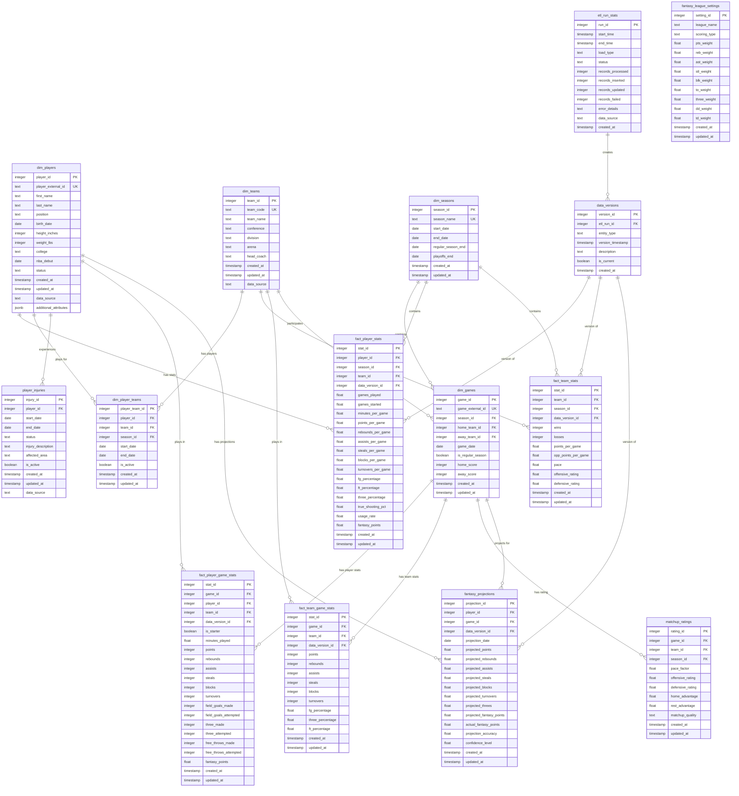

<think>我明白了，用户要求我进一步完善3-database-schema.md文档，特别是添加以下几方面的内容：

1. SQLAlchemy ORM映射示例：为关键表如dim_players和fact_player_stats提供SQLAlchemy模型定义
2. SQLAlchemy关系映射：说明如何在SQLAlchemy中定义表之间的关系(一对多、多对多)
3. 索引使用监控：在5.5节中添加如何通过pg_stat_user_indexes视图监控索引使用情况

我将在文档中添加这些内容来进一步增强对PostgreSQL和SQLAlchemy整合的描述。</think># NBA Fantasy Analytics Platform: 数据模型设计

## 1. 数据模型概述

本文档描述了NBA Fantasy Analytics Platform的数据模型设计。系统采用星型模式(Star Schema)进行设计，包括维度表(Dimensions)和事实表(Facts)，以支持高效的分析查询和报表生成。

### 1.1 设计原则

- **业务完整性**: 包含所有必要数据，支持Fantasy篮球分析需求
- **分析友好性**: 优化查询性能和报表生成，支持复杂聚合和筛选
- **扩展性**: 允许添加新数据源和指标，支持不同Fantasy比赛规则
- **历史追踪**: 维护数据版本和变更历史，支持趋势分析和回溯查询
- **PostgreSQL兼容性**: 充分利用PostgreSQL的特性，如JSON支持、数组类型、强大的索引选项和高级数据类型，以提高性能和开发效率

### 1.2 数据模型架构

本系统采用星型模式(Star Schema)设计，具有以下特点：

- **维度表**: 存储描述性属性，如球员、球队、比赛和赛季信息
- **事实表**: 存储度量值和统计数据，如球员统计、球队表现和比赛结果
- **关联表**: 处理多对多关系，如球员-球队关系
- **辅助表**: 支持特定功能，如伤病追踪和版本控制

## 2. 表描述

### 2.1 维度表(Dimensions)

#### dim_players
- **描述**: 存储所有NBA球员的基本信息
- **主要用途**: 提供球员维度查询和过滤
- **更新频率**: 周更新，有新球员时增量添加
- **估计记录数**: ~5,000 (所有活跃和历史NBA球员)
- **关键字段**: player_id, player_external_id, first_name, last_name, position

#### dim_teams
- **描述**: 存储所有NBA球队的基本信息
- **主要用途**: 提供球队维度查询和过滤
- **更新频率**: 季度更新，变化极少
- **估计记录数**: ~30 (当前联盟球队) + 历史球队
- **关键字段**: team_id, team_code, team_name, conference, division

#### dim_seasons
- **描述**: 存储NBA赛季信息
- **主要用途**: 时间维度分析，区分常规赛和季后赛
- **更新频率**: 年度更新
- **估计记录数**: ~80 (历史NBA赛季)
- **关键字段**: season_id, season_name, start_date, end_date, regular_season_end

#### dim_games
- **描述**: 存储每场比赛的基本信息
- **主要用途**: 比赛级别分析和筛选
- **更新频率**: 每日更新(赛季期间)
- **估计记录数**: ~1,230/赛季 (常规赛) + ~85/赛季 (季后赛)
- **关键字段**: game_id, game_external_id, home_team_id, away_team_id, game_date

#### dim_player_teams
- **描述**: 存储球员与球队的关联关系
- **主要用途**: 追踪球员交易和团队变更
- **更新频率**: 随球员交易更新
- **估计记录数**: ~15,000 (考虑历史交易)
- **关键字段**: player_team_id, player_id, team_id, season_id, start_date, end_date

### 2.2 事实表(Facts)

#### fact_player_stats
- **描述**: 存储球员按赛季汇总的统计数据
- **主要用途**: 球员季度表现分析，Fantasy积分计算
- **更新频率**: 每日更新(赛季期间)
- **估计记录数**: ~500/赛季
- **关键指标**: points_per_game, rebounds_per_game, assists_per_game, fantasy_points

#### fact_team_stats
- **描述**: 存储球队按赛季汇总的统计数据
- **主要用途**: 球队整体表现分析
- **更新频率**: 每日更新(赛季期间)
- **估计记录数**: ~30/赛季
- **关键指标**: wins, losses, points_per_game, defensive_rating, offensive_rating

#### fact_player_game_stats
- **描述**: 存储球员在每场比赛中的详细统计数据
- **主要用途**: 详细比赛分析，趋势识别
- **更新频率**: 每日更新(比赛结束后)
- **估计记录数**: ~24,000/赛季
- **关键指标**: points, rebounds, assists, fantasy_points

#### fact_team_game_stats
- **描述**: 存储球队在每场比赛中的统计数据
- **主要用途**: 球队比赛表现分析
- **更新频率**: 每日更新(比赛结束后)
- **估计记录数**: ~2,460/赛季
- **关键指标**: points, rebounds, assists, fg_percentage

### 2.3 辅助表(Supporting)

#### player_injuries
- **描述**: 追踪球员伤病历史和当前状态
- **主要用途**: 伤病分析和阵容决策
- **更新频率**: 实时更新(4小时)
- **估计记录数**: ~1,000/赛季
- **关键字段**: injury_id, player_id, status, start_date, end_date

#### matchup_ratings
- **描述**: 存储球队比赛对阵评级和因素分析
- **主要用途**: 比赛预测和Fantasy策略
- **更新频率**: 每日更新(赛季期间)
- **估计记录数**: ~2,460/赛季
- **关键指标**: pace_factor, offensive_rating, defensive_rating, home_advantage

#### fantasy_projections
- **描述**: 存储球员Fantasy表现预测
- **主要用途**: Fantasy决策支持
- **更新频率**: 每日更新(赛季期间)
- **估计记录数**: ~500/天
- **关键指标**: projected_fantasy_points, confidence_level, projection_accuracy

#### etl_run_stats
- **描述**: 记录ETL运行统计和元数据
- **主要用途**: 数据处理监控和审计
- **更新频率**: 每次ETL运行
- **估计记录数**: ~10/天

#### data_versions
- **描述**: 管理数据版本和变更历史
- **主要用途**: 数据血缘和时间点恢复
- **更新频率**: 每次ETL运行
- **估计记录数**: ~10/天

#### fantasy_league_settings
- **描述**: 存储不同Fantasy联赛的评分规则
- **主要用途**: 自定义积分计算
- **更新频率**: 按需更新
- **估计记录数**: ~10-50 (不同联赛设置)

## 3. 数据血缘与版本控制

### 3.1 Data Provenance & Versioning

数据频繁变化需要进行追踪：

- **数据收集时间**: 通过created_at和updated_at字段记录
- **数据来源**: 通过data_source字段标识数据提供者
- **预测准确性**: 记录和评估预测vs实际结果

### 3.2 ETL运行统计

ETL Run Statistics表(etl_run_stats)记录每次数据处理的关键指标：

- **执行时间**: start_time和end_time
- **处理量**: records_processed, records_inserted, records_updated, records_failed
- **错误详情**: error_details字段
- **加载类型**: load_type (全量 vs. 增量)

## 4. 实体关系图



## 5. 索引策略

高效查询性能对分析平台至关重要。以下索引策略基于预期的查询模式设计。

### 5.1 主要索引

| 表名 | 索引类型 | 索引字段 | 用途 |
|------|---------|---------|------|
| dim_players | 主键 | player_id | 唯一标识 |
| dim_players | 唯一索引 | player_external_id | 外部ID查询 |
| dim_players | 常规索引 | (last_name, first_name) | 名称搜索 |
| dim_players | 常规索引 | position | 按位置筛选 |
| dim_teams | 主键 | team_id | 唯一标识 |
| dim_teams | 唯一索引 | team_code | 按队伍代码查询 |
| dim_teams | 常规索引 | (conference, division) | 按联盟和分区查询 |
| dim_games | 主键 | game_id | 唯一标识 |
| dim_games | 常规索引 | game_date | 日期范围查询 |
| dim_games | 常规索引 | (home_team_id, away_team_id) | 查找特定对阵 |
| dim_seasons | 主键 | season_id | 唯一标识 |
| dim_seasons | 唯一索引 | season_name | 按赛季名称查询 |
| fact_player_stats | 主键 | stat_id | 唯一标识 |
| fact_player_stats | 常规索引 | (player_id, season_id) | 按球员和赛季查询 |
| fact_player_stats | 常规索引 | data_version_id | 版本查询 |
| fact_player_stats | 常规索引 | fantasy_points | 排名和筛选 |
| fact_player_game_stats | 主键 | stat_id | 唯一标识 |
| fact_player_game_stats | 常规索引 | (game_id, player_id) | 特定比赛和球员查询 |
| fact_player_game_stats | 常规索引 | player_id | 球员所有比赛查询 |
| fantasy_projections | 主键 | projection_id | 唯一标识 |
| fantasy_projections | 常规索引 | (player_id, projection_date) | 特定日期球员预测 |
| player_injuries | 主键 | injury_id | 唯一标识 |
| player_injuries | 常规索引 | (player_id, is_active) | 当前伤病查询 |

### 5.2 PostgreSQL特有的索引类型

| 表名 | 索引类型 | 索引字段 | 用途 |
|------|---------|---------|------|
| dim_players | GIN | additional_attributes | 球员附加属性的JSON查询 |
| dim_players | GIN | to_tsvector('english', first_name || ' ' || last_name) | 球员名称全文搜索 |
| fact_player_game_stats | BRIN | game_date | 大型表上的日期范围查询 |
| player_injuries | GiST | affected_area | 潜在的空间数据分析 |
| fact_player_stats | 部分索引 | WHERE fantasy_points > 30 | 高效筛选高绩效球员 |
| fantasy_projections | 表达式索引 | EXTRACT(DOW FROM projection_date) | 基于周日的查询优化 |

### 5.3 PostgreSQL索引创建示例

```sql
-- GIN索引用于JSON字段
CREATE INDEX idx_players_attributes ON dim_players USING GIN (additional_attributes);

-- 全文搜索索引
CREATE INDEX idx_players_fulltext ON dim_players USING GIN (to_tsvector('english', first_name || ' ' || last_name));

-- BRIN索引用于大型表的顺序数据
CREATE INDEX idx_player_game_stats_date_brin ON fact_player_game_stats USING BRIN (game_date);

-- 部分索引
CREATE INDEX idx_high_performance_players ON fact_player_stats (player_id, fantasy_points) 
WHERE fantasy_points > 30;

-- 表达式索引
CREATE INDEX idx_projection_day_of_week ON fantasy_projections (EXTRACT(DOW FROM projection_date));
```

### 5.4 索引维护

- **重建策略**: 每周在低峰期重建索引以避免碎片
- **统计更新**: 每天更新表统计以优化查询计划
- **性能监控**: 跟踪主要查询执行计划和响应时间

### 5.5 PostgreSQL索引维护和监控

```sql
-- 重建索引
REINDEX TABLE fact_player_game_stats;

-- 更新统计信息
ANALYZE dim_players;
ANALYZE fact_player_stats;

-- 查看索引使用情况
SELECT
    schemaname || '.' || relname AS table_name,
    indexrelname AS index_name,
    idx_scan AS scans,
    idx_tup_read AS tuples_read,
    idx_tup_fetch AS tuples_fetched,
    pg_size_pretty(pg_relation_size(indexrelid::regclass)) AS index_size
FROM pg_stat_user_indexes
ORDER BY idx_scan DESC;

-- 查找未使用的索引（潜在可删除的索引）
SELECT
    schemaname || '.' || relname AS table_name,
    indexrelname AS index_name,
    pg_size_pretty(pg_relation_size(indexrelid::regclass)) AS index_size
FROM pg_stat_user_indexes
WHERE idx_scan = 0
    AND indexrelname NOT LIKE 'pg_%'  -- 排除PostgreSQL系统索引
ORDER BY pg_relation_size(indexrelid::regclass) DESC;

-- 查看索引膨胀情况
SELECT
    schemaname || '.' || tablename AS table_name,
    indexname AS index_name,
    pg_size_pretty(pg_relation_size(indexrelid)) AS index_size,
    ROUND(100 * (bloat_ratio - 1)) AS bloat_pct
FROM pgstatindex(indexrelid) AS s
JOIN pg_stat_user_indexes AS u
    ON s.indexrelid = u.indexrelid
WHERE bloat_ratio > 1.2  -- 超过20%的膨胀率
ORDER BY bloat_pct DESC;
```

## 6. 分区策略

为大型表实施分区以提高性能和可管理性。

### 6.1 PostgreSQL分区方案

| 表名 | 分区类型 | 分区键 | 分区策略 |
|------|---------|--------|---------|
| fact_player_game_stats | 范围分区 | game_date | 按月分区 |
| fact_team_game_stats | 范围分区 | game_date | 按月分区 |
| fantasy_projections | 范围分区 | projection_date | 按月分区 |
| etl_run_stats | 范围分区 | start_time | 按月分区 |

### 6.2 PostgreSQL声明式分区示例

```sql
-- 创建主分区表
CREATE TABLE fact_player_game_stats (
    stat_id SERIAL,
    game_id INTEGER NOT NULL,
    player_id INTEGER NOT NULL,
    team_id INTEGER NOT NULL,
    game_date DATE NOT NULL,
    data_version_id INTEGER,
    is_starter BOOLEAN,
    minutes_played FLOAT,
    points INTEGER,
    rebounds INTEGER,
    assists INTEGER,
    steals INTEGER,
    blocks INTEGER,
    turnovers INTEGER,
    field_goals_made INTEGER,
    field_goals_attempted INTEGER,
    three_made INTEGER,
    three_attempted INTEGER,
    free_throws_made INTEGER,
    free_throws_attempted INTEGER,
    fantasy_points FLOAT,
    created_at TIMESTAMP DEFAULT CURRENT_TIMESTAMP,
    updated_at TIMESTAMP DEFAULT CURRENT_TIMESTAMP,
    PRIMARY KEY (stat_id, game_date)
) PARTITION BY RANGE (game_date);

-- 创建月度分区
CREATE TABLE fact_player_game_stats_y2023m01
    PARTITION OF fact_player_game_stats
    FOR VALUES FROM ('2023-01-01') TO ('2023-02-01');

CREATE TABLE fact_player_game_stats_y2023m02
    PARTITION OF fact_player_game_stats
    FOR VALUES FROM ('2023-02-01') TO ('2023-03-01');

-- 分区维护 - 添加新分区
CREATE TABLE fact_player_game_stats_y2023m03
    PARTITION OF fact_player_game_stats
    FOR VALUES FROM ('2023-03-01') TO ('2023-04-01');
```

### 6.3 PostgreSQL分区维护自动化

```sql
-- 创建自动添加下个月分区的函数
CREATE OR REPLACE FUNCTION create_next_month_partition()
RETURNS void AS $$
DECLARE
    next_month_start DATE;
    next_month_end DATE;
    partition_name TEXT;
    year_month TEXT;
BEGIN
    -- 计算下个月的起止日期
    next_month_start := date_trunc('month', CURRENT_DATE + INTERVAL '1 month');
    next_month_end := date_trunc('month', next_month_start + INTERVAL '1 month');
    
    -- 格式化分区名称 (例如: fact_player_game_stats_y2023m04)
    year_month := to_char(next_month_start, 'y"y"YYYY"m"MM');
    partition_name := 'fact_player_game_stats_' || year_month;
    
    -- 创建分区(如果不存在)
    IF NOT EXISTS (
        SELECT 1 FROM pg_class c JOIN pg_namespace n ON n.oid = c.relnamespace
        WHERE c.relname = partition_name AND n.nspname = 'public'
    ) THEN
        EXECUTE format('
            CREATE TABLE %I PARTITION OF fact_player_game_stats
            FOR VALUES FROM (%L) TO (%L)
        ', partition_name, next_month_start, next_month_end);
        
        RAISE NOTICE 'Created partition %', partition_name;
    END IF;
END;
$$ LANGUAGE plpgsql;

-- 使用pg_cron每月执行一次
SELECT cron.schedule('0 0 15 * *', 'SELECT create_next_month_partition()');
```

### 6.4 分区维护

- **归档策略**: 历史分区自动移动到低成本存储
- **分区切换**: 创建新分区自动化以支持滚动时间窗口

## 7. 数据存储估算

| 表名 | 每行大小(字节) | 初始行数 | 年增长率 | 3年总大小(GB) |
|------|--------------|---------|---------|--------------|
| dim_players | 1,000 | 5,000 | 500 | 0.01 |
| dim_teams | 800 | 30 | 0 | 0.001 |
| dim_games | 500 | 1,315 | 1,315 | 0.01 |
| dim_seasons | 300 | 80 | 1 | 0.001 |
| fact_player_stats | 300 | 5,000 | 500 | 0.01 |
| fact_player_game_stats | 400 | 24,000 | 24,000 | 0.5 |
| fact_team_game_stats | 300 | 2,460 | 2,460 | 0.01 |
| player_injuries | 300 | 1,000 | 1,000 | 0.01 |
| fantasy_projections | 400 | 180,000 | 180,000 | 3.0 |
| **总计** | | | | **~3.6 GB** |

### 7.1 存储考虑

- 主数据库约需4GB存储空间(包括索引)
- 备份策略: 每日全量 + 持续事务日志备份
- 历史数据归档到低成本存储层
- PostgreSQL的TOAST存储可自动压缩大型字段，节省空间

### 7.2 PostgreSQL存储优化

```sql
-- 表存储参数示例
ALTER TABLE fact_player_game_stats SET (
    autovacuum_vacuum_scale_factor = 0.05,  -- 较低的阈值更频繁地触发清理
    autovacuum_analyze_scale_factor = 0.02, -- 较低的阈值更频繁地触发分析
    fillfactor = 80                         -- 留出空间供更新使用，减少页面分裂
);

-- 为历史数据创建表空间示例(若需要在不同存储介质上管理数据)
CREATE TABLESPACE historical_data LOCATION '/path/to/historical_storage';

-- 移动过时分区到历史表空间
ALTER TABLE fact_player_game_stats_y2020m01 SET TABLESPACE historical_data;
```

## 8. SQLAlchemy ORM映射与关系管理

### 8.1 基础ORM模型映射

利用SQLAlchemy将PostgreSQL数据模型映射到Python对象：

```python
from sqlalchemy import Column, Integer, String, Float, Boolean, Date, DateTime, ForeignKey, Text, func
from sqlalchemy.dialects.postgresql import JSONB
from sqlalchemy.ext.declarative import declarative_base
from sqlalchemy.orm import relationship

Base = declarative_base()

class Player(Base):
    """球员维度表ORM映射"""
    __tablename__ = 'dim_players'
    
    player_id = Column(Integer, primary_key=True)
    player_external_id = Column(String, unique=True, nullable=False)
    first_name = Column(String, nullable=False)
    last_name = Column(String, nullable=False)
    position = Column(String)
    birth_date = Column(Date)
    height_inches = Column(Integer)
    weight_lbs = Column(Integer)
    college = Column(String)
    nba_debut = Column(Date)
    status = Column(String)
    created_at = Column(DateTime, default=func.now())
    updated_at = Column(DateTime, default=func.now(), onupdate=func.now())
    data_source = Column(String)
    additional_attributes = Column(JSONB)
    
    # 定义关系
    player_stats = relationship("PlayerStats", back_populates="player")
    player_game_stats = relationship("PlayerGameStats", back_populates="player")
    player_teams = relationship("PlayerTeam", back_populates="player")
    injuries = relationship("PlayerInjury", back_populates="player")
    fantasy_projections = relationship("FantasyProjection", back_populates="player")
    
    def __repr__(self):
        return f"<Player(id={self.player_id}, name={self.first_name} {self.last_name})>"
    
    @property
    def full_name(self):
        return f"{self.first_name} {self.last_name}"


class Team(Base):
    """球队维度表ORM映射"""
    __tablename__ = 'dim_teams'
    
    team_id = Column(Integer, primary_key=True)
    team_code = Column(String, unique=True, nullable=False)
    team_name = Column(String, nullable=False)
    conference = Column(String)
    division = Column(String)
    arena = Column(String)
    head_coach = Column(String)
    created_at = Column(DateTime, default=func.now())
    updated_at = Column(DateTime, default=func.now(), onupdate=func.now())
    data_source = Column(String)
    
    # 定义关系
    team_stats = relationship("TeamStats", back_populates="team")
    team_game_stats = relationship("TeamGameStats", back_populates="team")
    player_teams = relationship("PlayerTeam", back_populates="team")
    # 定义与比赛的关系 - 主场和客场
    home_games = relationship("Game", foreign_keys="Game.home_team_id", back_populates="home_team")
    away_games = relationship("Game", foreign_keys="Game.away_team_id", back_populates="away_team")
    
    def __repr__(self):
        return f"<Team(id={self.team_id}, name={self.team_name})>"


class Season(Base):
    """赛季维度表ORM映射"""
    __tablename__ = 'dim_seasons'
    
    season_id = Column(Integer, primary_key=True)
    season_name = Column(String, unique=True, nullable=False)
    start_date = Column(Date, nullable=False)
    end_date = Column(Date, nullable=False)
    regular_season_end = Column(Date)
    playoffs_end = Column(Date)
    created_at = Column(DateTime, default=func.now())
    updated_at = Column(DateTime, default=func.now(), onupdate=func.now())
    
    # 定义关系
    games = relationship("Game", back_populates="season")
    player_stats = relationship("PlayerStats", back_populates="season")
    team_stats = relationship("TeamStats", back_populates="season")
    
    def __repr__(self):
        return f"<Season(id={self.season_id}, name={self.season_name})>"


class Game(Base):
    """比赛维度表ORM映射"""
    __tablename__ = 'dim_games'
    
    game_id = Column(Integer, primary_key=True)
    game_external_id = Column(String, unique=True, nullable=False)
    season_id = Column(Integer, ForeignKey('dim_seasons.season_id'), nullable=False)
    home_team_id = Column(Integer, ForeignKey('dim_teams.team_id'), nullable=False)
    away_team_id = Column(Integer, ForeignKey('dim_teams.team_id'), nullable=False)
    game_date = Column(Date, nullable=False)
    is_regular_season = Column(Boolean, default=True)
    home_score = Column(Integer)
    away_score = Column(Integer)
    created_at = Column(DateTime, default=func.now())
    updated_at = Column(DateTime, default=func.now(), onupdate=func.now())
    
    # 定义关系
    season = relationship("Season", back_populates="games")
    home_team = relationship("Team", foreign_keys=[home_team_id], back_populates="home_games")
    away_team = relationship("Team", foreign_keys=[away_team_id], back_populates="away_games")
    player_game_stats = relationship("PlayerGameStats", back_populates="game")
    team_game_stats = relationship("TeamGameStats", back_populates="game")
    matchup_ratings = relationship("MatchupRating", back_populates="game")
    fantasy_projections = relationship("FantasyProjection", back_populates="game")
    
    def __repr__(self):
        return f"<Game(id={self.game_id}, date={self.game_date}, {self.away_team_id}@{self.home_team_id})>"


class PlayerStats(Base):
    """球员赛季统计表ORM映射"""
    __tablename__ = 'fact_player_stats'
    
    stat_id = Column(Integer, primary_key=True)
    player_id = Column(Integer, ForeignKey('dim_players.player_id'), nullable=False)
    season_id = Column(Integer, ForeignKey('dim_seasons.season_id'), nullable=False)
    team_id = Column(Integer, ForeignKey('dim_teams.team_id'))
    data_version_id = Column(Integer, ForeignKey('data_versions.version_id'))
    
    games_played = Column(Float)
    games_started = Column(Float)
    minutes_per_game = Column(Float)
    points_per_game = Column(Float)
    rebounds_per_game = Column(Float)
    assists_per_game = Column(Float)
    steals_per_game = Column(Float)
    blocks_per_game = Column(Float)
    turnovers_per_game = Column(Float)
    fg_percentage = Column(Float)
    ft_percentage = Column(Float)
    three_percentage = Column(Float)
    true_shooting_pct = Column(Float)
    usage_rate = Column(Float)
    fantasy_points = Column(Float)
    
    created_at = Column(DateTime, default=func.now())
    updated_at = Column(DateTime, default=func.now(), onupdate=func.now())
    
    # 定义关系
    player = relationship("Player", back_populates="player_stats")
    season = relationship("Season", back_populates="player_stats")
    team = relationship("Team", back_populates="
