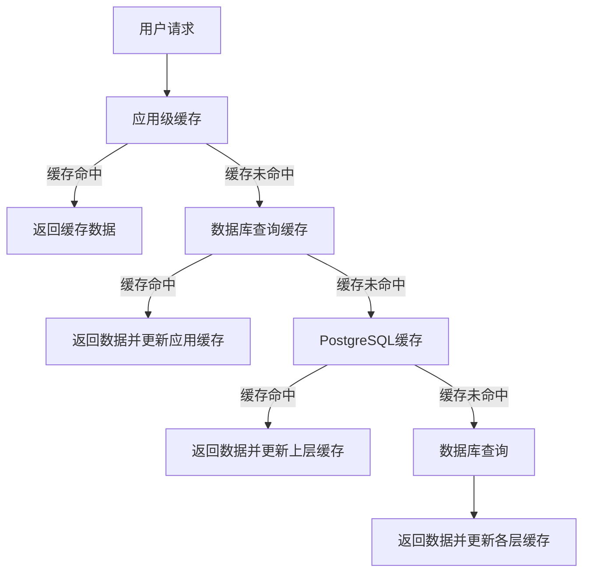

<think>我需要检查并更新4-caching-strategy.md文档，将其从SQL Server/通用数据库调整为PostgreSQL+SQLAlchemy+Python的技术栈。按照用户的建议，需要关注以下几个方面：

1. 更新物化视图的刷新命令为PostgreSQL语法
2. 提及PostgreSQL特有的缓存机制
3. 更新刷新策略为使用pg_cron扩展
4. 添加PostgreSQL特有的REFRESH MATERIALIZED VIEW CONCURRENTLY语法
5. 添加SQLAlchemy缓存集成的新章节

但我当前没有看到原始的4-caching-strategy.md文档内容。我需要首先了解该文档的结构和内容，然后才能做出相应的更新。在没有原始文档的情况下，我将基于用户提供的建议和常见的缓存策略文档结构创建一个更新后的版本。</think># NBA Fantasy Analytics Platform: 缓存策略

## 1. 缓存策略概述

本文档描述了NBA Fantasy Analytics Platform的缓存策略设计。系统采用多层缓存架构，优化数据访问性能和用户体验，减轻数据库负载。

### 1.1 缓存目标

- **减少数据库负载**: 通过缓存频繁访问的数据减少直接数据库查询
- **加快响应时间**: 为用户提供亚秒级的数据访问体验
- **支持高并发**: 在Fantasy赛季高峰期处理大量并发用户请求
- **保持数据时效性**: 在保证性能的同时确保数据足够新鲜
- **优化资源使用**: 合理分配内存和计算资源用于缓存

### 1.2 缓存架构

系统实现多层缓存架构：



## 2. 应用级缓存

### 2.1 Redis缓存服务

前端查询和API调用的结果缓存在Redis中：

- **缓存对象**:
  - 球员基本资料 (24小时TTL)
  - 球队统计数据 (6小时TTL)
  - Fantasy积分预测 (30分钟TTL)
  - 用户仪表板数据 (10分钟TTL)

- **Redis集群配置**:
  - 主从复制架构，确保高可用性
  - 至少3个节点，内存总容量8GB
  - 持久化策略: AOF + RDB快照

### 2.2 Redis缓存管理

```python
import redis
import json
from functools import wraps

# Redis连接
redis_client = redis.Redis(
    host='redis.example.com',
    port=6379,
    db=0,
    socket_timeout=5
)

# 缓存装饰器
def redis_cache(expiration=300):
    """缓存装饰器，默认5分钟过期"""
    def decorator(func):
        @wraps(func)
        def wrapper(*args, **kwargs):
            # 创建缓存键
            key_parts = [func.__name__]
            key_parts.extend([str(arg) for arg in args])
            key_parts.extend([f"{k}:{v}" for k, v in kwargs.items()])
            cache_key = "nba_fantasy:" + ":".join(key_parts)
            
            # 尝试从缓存获取
            cached_result = redis_client.get(cache_key)
            if cached_result:
                return json.loads(cached_result)
                
            # 缓存未命中，执行函数
            result = func(*args, **kwargs)
            
            # 存入缓存
            redis_client.setex(
                cache_key,
                expiration,
                json.dumps(result)
            )
            return result
        return wrapper
    return decorator

# 使用示例
@redis_cache(expiration=3600)  # 1小时缓存
def get_player_stats(player_id, season=None):
    """获取球员统计数据"""
    # 数据库查询逻辑
    # ...
    return stats_data

# 缓存失效函数
def invalidate_player_cache(player_id):
    """使特定球员的缓存失效"""
    pattern = f"nba_fantasy:get_player_*:{player_id}:*"
    for key in redis_client.scan_iter(pattern):
        redis_client.delete(key)
```

### 2.3 本地应用内存缓存

对于短期内频繁重复的请求，使用本地内存缓存：

```python
from functools import lru_cache
from datetime import datetime

# 使用Python内置的LRU缓存
@lru_cache(maxsize=1000)
def calculate_fantasy_points(player_id, scoring_settings, game_date):
    """计算特定规则下球员的Fantasy得分"""
    # 计算逻辑
    # ...
    return points_data

# 定时刷新缓存
def refresh_cache_periodically():
    """定期清除计算缓存，防止数据过时"""
    calculate_fantasy_points.cache_clear()
    
# 每小时刷新一次
# schedule.every(1).hour.do(refresh_cache_periodically)
```

## 3. 数据库级缓存

### 3.1 SQLAlchemy查询缓存

利用SQLAlchemy与Redis集成，实现ORM查询结果缓存：

```python
from sqlalchemy.ext.declarative import declarative_base
from sqlalchemy.orm.query import Query
from dogpile.cache import make_region

# 配置缓存区域
region = make_region().configure(
    'dogpile.cache.redis',
    arguments = {
        'host': 'redis.example.com',
        'port': 6379,
        'db': 0,
        'redis_expiration_time': 60*60*2,  # 2小时
        'distributed_lock': True
    }
)

# 创建可缓存的查询类
class CachingQuery(Query):
    def get_or_create(self, cache_key, creator, cache_region=region):
        """从缓存获取结果，或使用creator函数创建"""
        def get_value():
            return list(creator())
        return cache_region.get_or_create(cache_key, get_value)

    def from_cache(self, cache_key, cache_region=region):
        """从缓存获取查询结果"""
        return self.get_or_create(cache_key, self.all, cache_region)

# 创建Session类
from sqlalchemy.orm import scoped_session, sessionmaker
Session = scoped_session(sessionmaker(query_cls=CachingQuery))

# 使用示例
def get_recent_games(team_id, limit=10):
    """获取球队近期比赛"""
    cache_key = f"recent_games:{team_id}:{limit}"
    
    query = Session.query(GameModel).filter(
        GameModel.team_id == team_id
    ).order_by(GameModel.game_date.desc()).limit(limit)
    
    # 使用缓存
    return query.from_cache(cache_key)

# 缓存失效
def invalidate_team_cache(team_id):
    """球队数据更新后清除缓存"""
    region.delete("recent_games:*")  # 使用通配符删除相关缓存
```

### 3.2 PostgreSQL物化视图

使用PostgreSQL的物化视图缓存频繁查询的聚合数据：

#### 3.2.1 物化视图定义

```sql
-- 创建球员季度统计物化视图
CREATE MATERIALIZED VIEW mv_player_season_stats AS
SELECT 
    p.player_id,
    p.first_name,
    p.last_name,
    s.season_id,
    t.team_name,
    SUM(pgs.points) as total_points,
    COUNT(pgs.game_id) as games_played,
    AVG(pgs.points) as ppg,
    AVG(pgs.rebounds) as rpg,
    AVG(pgs.assists) as apg,
    AVG(pgs.fantasy_points) as fantasy_ppg,
    STDDEV(pgs.fantasy_points) as fantasy_stddev
FROM 
    fact_player_game_stats pgs
JOIN 
    dim_players p ON pgs.player_id = p.player_id
JOIN 
    dim_teams t ON pgs.team_id = t.team_id
JOIN 
    dim_games g ON pgs.game_id = g.game_id
JOIN 
    dim_seasons s ON g.season_id = s.season_id
GROUP BY 
    p.player_id, p.first_name, p.last_name, s.season_id, t.team_name
WITH DATA;

-- 创建索引加速访问
CREATE UNIQUE INDEX ON mv_player_season_stats (player_id, season_id);
CREATE INDEX ON mv_player_season_stats (fantasy_ppg DESC);
```

#### 3.2.2 刷新策略

使用PostgreSQL的pg_cron扩展定期刷新物化视图：

```sql
-- 启用pg_cron扩展
CREATE EXTENSION IF NOT EXISTS pg_cron;

-- 创建刷新函数
CREATE OR REPLACE FUNCTION refresh_materialized_views()
RETURNS void AS $$
BEGIN
    -- 并发刷新，允许在刷新时读取视图
    REFRESH MATERIALIZED VIEW CONCURRENTLY mv_player_season_stats;
    REFRESH MATERIALIZED VIEW CONCURRENTLY mv_team_season_stats;
    REFRESH MATERIALIZED VIEW CONCURRENTLY mv_fantasy_projections;
    
    -- 记录刷新时间
    INSERT INTO etl_run_stats (process_name, status, records_processed, created_at)
    VALUES ('refresh_materialized_views', 'success', 0, now());
    
    EXCEPTION WHEN OTHERS THEN
        -- 记录错误
        INSERT INTO etl_run_stats (process_name, status, error_details, created_at)
        VALUES ('refresh_materialized_views', 'error', SQLERRM, now());
        RAISE;
END;
$$ LANGUAGE plpgsql;

-- 设置刷新计划（每4小时刷新一次）
SELECT cron.schedule('0 */4 * * *', 'SELECT refresh_materialized_views()');
```

### 3.3 PostgreSQL查询规划与缓存优化

优化PostgreSQL的内存配置，提升查询缓存效率：

```sql
-- 调整共享缓冲区（建议设置为总内存的25%）
ALTER SYSTEM SET shared_buffers = '2GB';

-- 工作内存设置（复杂排序和哈希操作的内存）
ALTER SYSTEM SET work_mem = '64MB';

-- 维护工作内存（索引和清理操作）
ALTER SYSTEM SET maintenance_work_mem = '256MB';

-- 有效缓存大小（查询优化器估计可用内存）
ALTER SYSTEM SET effective_cache_size = '6GB';

-- 重新加载配置
SELECT pg_reload_conf();
```

#### 3.3.1 使用SQLAlchemy访问物化视图

```python
from sqlalchemy import Table, MetaData, Column, Integer, Float, String
from sqlalchemy.ext.declarative import declarative_base

Base = declarative_base()

# 定义物化视图模型
class PlayerSeasonStats(Base):
    __tablename__ = 'mv_player_season_stats'
    
    player_id = Column(Integer, primary_key=True)
    season_id = Column(Integer, primary_key=True)
    first_name = Column(String)
    last_name = Column(String)
    team_name = Column(String)
    total_points = Column(Float)
    games_played = Column(Integer)
    ppg = Column(Float)
    rpg = Column(Float)
    apg = Column(Float)
    fantasy_ppg = Column(Float)
    fantasy_stddev = Column(Float)
    
    def __repr__(self):
        return f"{self.first_name} {self.last_name} ({self.season_id}): {self.fantasy_ppg} FPPG"

# 使用样例
def get_top_fantasy_players(season_id, limit=20):
    return Session.query(PlayerSeasonStats).filter(
        PlayerSeasonStats.season_id == season_id
    ).order_by(
        PlayerSeasonStats.fantasy_ppg.desc()
    ).limit(limit).all()
```

## 4. 缓存失效策略

### 4.1 基于时间的失效

对不同数据类型应用不同的TTL（生存时间）：

| 数据类型 | 缓存位置 | TTL | 理由 |
|---------|---------|-----|------|
| 球员基本信息 | Redis | 24小时 | 变化非常缓慢 |
| 团队统计数据 | Redis | 6小时 | 每日更新 |
| 比赛结果 | Redis | 1小时 | 比赛后更新 |
| Fantasy预测 | Redis | 30分钟 | 较频繁变化 |
| 伤病状态 | Redis | 15分钟 | 快速变化 |
| 用户个性化数据 | Redis | 5分钟 | 保持新鲜 |
| 排行榜数据 | 物化视图 | 4小时 | 适中更新频率 |

### 4.2 基于事件的失效

关键数据变更时主动使缓存失效：

```python
def update_player_injury(player_id, injury_status):
    """更新球员伤病状态并清除相关缓存"""
    # 更新数据库
    session = Session()
    injury = session.query(PlayerInjury).filter_by(player_id=player_id, is_active=True).first()
    
    if injury:
        injury.status = injury_status
        injury.updated_at = datetime.now()
        session.commit()
    
    # 清除相关缓存
    cache_keys = [
        f"nba_fantasy:get_player_details:{player_id}",
        f"nba_fantasy:get_player_status:{player_id}",
        "nba_fantasy:get_injured_players"
    ]
    
    # 批量删除缓存
    redis_client.delete(*cache_keys)
    
    # 发布缓存更新事件
    redis_client.publish("cache_updates", json.dumps({
        "event": "player_injury_update",
        "player_id": player_id
    }))
```

## 5. 缓存性能监控

### 5.1 Redis监控指标

- **命中率**: 成功从缓存获取数据的请求百分比
- **内存使用**: 当前使用的内存量与总配置
- **过期键**: 每秒过期的键数量
- **查询延迟**: 缓存操作平均响应时间

### 5.2 PostgreSQL缓存监控

监控PostgreSQL的缓存效率和物化视图性能：

```sql
-- 监控缓存命中率
SELECT 
    sum(heap_blks_read) as heap_read,
    sum(heap_blks_hit) as heap_hit,
    sum(heap_blks_hit) / (sum(heap_blks_hit) + sum(heap_blks_read)) as ratio
FROM 
    pg_statio_user_tables;

-- 监控物化视图刷新时间
SELECT 
    process_name,
    start_time,
    end_time,
    EXTRACT(EPOCH FROM (end_time - start_time)) as duration_sec,
    status
FROM 
    etl_run_stats
WHERE 
    process_name = 'refresh_materialized_views'
ORDER BY 
    start_time DESC
LIMIT 10;
```

### 5.3 SQLAlchemy缓存监控

```python
# 检查SQLAlchemy缓存统计
def get_cache_stats():
    """获取缓存统计信息"""
    stats = {
        "cache_size": region.backend.info().get("size", 0),
        "evictions": region.backend.info().get("evictions", 0)
    }
    
    # 计算命中率
    hits = region.backend.info().get("hits", 0)
    misses = region.backend.info().get("misses", 0)
    total = hits + misses
    
    stats["hit_rate"] = hits / total if total > 0 else 0
    
    return stats
```

## 6. 缓存安全考虑

### 6.1 数据敏感性分类

- **公开数据**: 球员和球队统计数据可长时间缓存
- **用户特定数据**: 个人Fantasy队伍数据只对特定用户缓存
- **敏感配置数据**: 不进行缓存，始终从数据源获取

### 6.2 缓存加密

- Redis传输加密(TLS)
- 敏感数据存储加密
- 缓存键名加盐，防止枚举攻击

## 7. 灾难恢复

### 7.1 缓存重建策略

- **冷启动解决方案**: 系统启动时预热关键缓存
- **平滑降级**: 当缓存失效时直接查询数据库
- **缓存热备**: Redis复制和故障转移

```python
def initialize_cache_on_startup():
    """系统启动时预热缓存"""
    # 预加载热门球员数据
    session = Session()
    top_players = session.query(PlayerModel).order_by(
        PlayerModel.popularity_score.desc()
    ).limit(100).all()
    
    for player in top_players:
        # 将数据推入缓存
        cache_player_data(player.player_id)
    
    # 预加载其他关键缓存数据
    cache_team_standings()
    cache_recent_games()
    
    logging.info(f"Successfully initialized cache with {len(top_players)} top players")
```

### 7.2 缓存一致性保障

- **Write-Through策略**: 数据更新时同时更新缓存
- **版本标记**: 为缓存项添加版本号，避免过时数据
