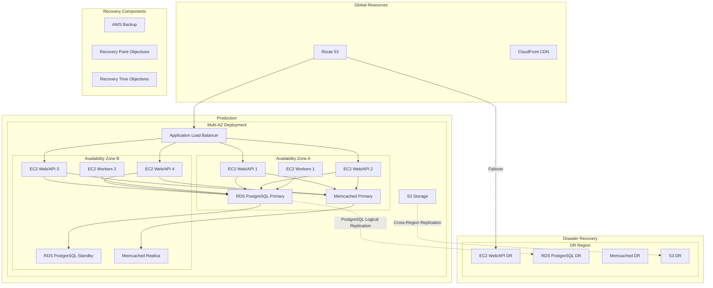

# NBA Fantasy Analytics Platform 运维策略

## 执行摘要

本文档定义了NBA Fantasy Analytics Platform的全面运维策略，涵盖环境管理、高可用设计、监控告警、安全策略、日常运维流程以及成本优化方案。设计以AWS云服务为基础，采用PostgreSQL、SQLAlchemy和Python技术栈，旨在提供稳定、安全、高效的服务运行环境，同时优化资源使用和成本效益。本策略支持系统的可靠性、可用性、可维护性和可扩展性目标，为用户提供高质量的Fantasy篮球分析服务。

> **文档关系**: 本运维策略文档详细说明了[架构设计](1-architecture.md)中提到的部署和运维方案的具体实现。技术选择的详细理由请参考[技术栈决策文档](6-tech-stack-decisions.md)，数据库维护的具体操作与数据库设计相关内容请参考[数据模型文档](3-database-schema.md)，数据处理流程管理请参考[ETL Pipeline文档](2-ETL-Pipeline.md)，缓存配置和维护细节请参考[缓存策略文档](4-caching-strategy.md)。团队开发规范、Git工作流程和开发者相关指南请参考[开发规范文档](8-development-guidelines.md)，该文档与本文档互为补充，分别从开发者和运维角度提供指导。

## 1. 环境分离策略

系统采用完整的环境分离策略，确保开发、测试和生产环境的隔离。

### 1.1 环境结构


### 1.2 环境特点

| 环境 | 用途 | 基础设施 | 访问控制 |
|------|------|----------|----------|
| 开发 | 开发人员本地开发和初步测试 | 本地PostgreSQL, 开发AWS账户 | 开发团队完全访问 |
| 测试 | 集成测试和验收测试 | 独立AWS账户/VPC, RDS PostgreSQL | 开发团队读写，QA团队完全访问 |
| 生产 | 真实用户访问 | 完整AWS HA配置, RDS PostgreSQL多可用区 | 运维团队完全访问，开发有限访问 |

### 1.3 配置管理

- 使用环境变量和配置文件区分不同环境
- 敏感配置（如数据库凭证）存储在AWS Secrets Manager
- 环境特定配置参数通过CI/CD部署过程注入
- 配置变更通过版本控制和审核流程管理
- PostgreSQL连接字符串和配置通过参数组管理

### 1.4 环境提升流程

1. **开发到测试**：
   - 开发完成后，通过Pull Request触发CI验证
   - 自动化测试通过后，由技术负责人审核代码
   - 审核通过后，自动部署到测试环境
   - 执行数据库迁移脚本（使用SQLAlchemy Alembic）

2. **测试到生产**：
   - 测试环境验收测试通过
   - 变更请求获得产品负责人批准
   - 在预定维护窗口执行生产部署
   - 数据库迁移脚本经过预先验证后应用
   - 部署后执行验证测试确认功能正常

## 2. 高可用架构

系统采用AWS多可用区设计，确保服务高可用性和灾难恢复能力。

> **注意**: 本章节详细说明了[架构设计](1-architecture.md)中"部署架构"章节所描述的高可用性和容错策略的具体实现方案。

### 2.1 高可用架构图



### 2.2 高可用组件

| 组件 | 高可用策略 | 故障切换机制 |
|------|------------|--------------|
| Web应用 | EC2 Auto Scaling + 多可用区部署 | ALB健康检查，自动替换不健康实例 |
| PostgreSQL数据库 | RDS PostgreSQL Multi-AZ部署 | 自动故障切换到备用实例，通常在60-120秒内完成 |
| PostgreSQL复制 | 同步复制到备用实例 + WAL日志传输 | RDS自动管理复制和故障切换 |
| 跨区域数据库 | PostgreSQL逻辑复制 | 主区域故障时可升级灾备区域数据库为主数据库 |
| 缓存 | ElastiCache for Memcached（利用AWS Free Tier）| 可配置多节点，应用层处理节点失效 |
| 存储 | S3跨区域复制 | 通过Route 53故障转移路由 |
| API服务 | EC2 Auto Scaling + 多可用区部署 | ALB健康检查，自动替换不健康实例 |

### 2.3 PostgreSQL高可用特性

- **同步流复制**：确保备用实例与主实例同步，避免数据丢失
- **自动故障转移**：当主实例不可用时，RDS自动提升备用实例为主实例
- **只读副本**：用于分担读取负载，可部署在不同可用区提高可用性
- **多可用区部署**：主实例和备用实例分布在不同的可用区，防止单一区域故障
- **连接管理**：应用端使用连接池（通过SQLAlchemy）管理数据库连接，支持故障重连

### 2.4 灾难恢复策略

| 指标 | 目标 | 实现方式 |
|------|------|----------|
| RPO (恢复点目标) | < 15分钟 | PostgreSQL WAL归档，RDS自动备份，逻辑复制 |
| RTO (恢复时间目标) | < 1小时 | Route 53故障转移，跨区域备份，PostgreSQL PITR |

### 2.5 容量规划

| 组件 | 基准容量 | 峰值容量 | 扩展触发条件 |
|------|---------|---------|------------|
| EC2 Web/API | 2x t3.micro (Free Tier) | 最高4x t3.micro | CPU利用率>70%持续5分钟 |
| RDS PostgreSQL | db.t3.micro (Free Tier) | 可升级到db.t3.small | 内存利用率>80%，连接数>80%，I/O等待>10% |
| ElastiCache | cache.t3.micro (Free Tier) | 可增加节点 | 内存利用率>75%持续15分钟 |
| S3存储 | 预估50GB/月增长 | 根据数据增长弹性扩展 | - |

## 3. 监控与警报

### 3.1 关键监控指标

#### 3.1.1 基础设施指标
- CPU使用率、内存使用率、磁盘空间
- 网络流量、负载均衡器状态

#### 3.1.2 应用指标
- 请求延迟、错误率、API调用量
- Python应用内存使用和垃圾回收指标
- SQLAlchemy连接池状态和查询性能

#### 3.1.3 PostgreSQL特有监控指标
- **连接指标**：当前连接数、空闲连接、活跃查询数
- **性能指标**：缓存命中率、缓冲区使用率、查询执行时间
- **锁指标**：锁等待事件、死锁统计、长事务监控
- **VACUUM进程**：自动清理状态、VACUUM进度、VACUUM延迟时间
- **表膨胀**：表和索引膨胀率、空间使用效率
- **WAL指标**：WAL生成速率、归档状态、复制延迟
- **索引使用**：索引扫描率、索引效率、未使用索引

#### 3.1.4 数据管道指标
- ETL作业成功率、处理时间、数据质量指标
- SQLAlchemy批量操作性能

#### 3.1.5 业务指标
- 活跃用户数、查询性能、预测准确率

### 3.2 警报策略

#### 3.2.1 严重性等级

| 严重性 | 描述 | 响应时间 | 示例 |
|-------|------|---------|------|
| P1-关键 | 影响所有用户的生产服务中断 | 15分钟内响应，持续工作直至解决 | 网站不可访问，PostgreSQL数据库宕机 |
| P2-高 | 部分功能不可用，有临时解决方案 | 30分钟内响应，工作时间内解决 | API性能严重下降，PostgreSQL复制落后 |
| P3-中 | 次要功能不可用，不影响核心功能 | 4小时内响应，48小时内解决 | 非关键报告无法生成，PostgreSQL表膨胀 |
| P4-低 | 轻微问题，对用户几乎无感知 | 下个工作日响应，根据优先级安排 | UI小缺陷，非紧急优化 |

#### 3.2.2 PostgreSQL特有警报

| 指标 | 警告阈值 | 严重阈值 | 严重性 |
|------|---------|---------|-------|
| 连接数 | >75% 最大连接数 | >90% 最大连接数 | P2 |
| 缓存命中率 | <95% | <90% | P3 |
| 复制延迟 | >30秒 | >5分钟 | P2 |
| 事务ID耗尽 | 接近预警值 | 接近临界值 | P1 |
| 表膨胀率 | >20% | >40% | P3 |
| 长事务 | >5分钟 | >15分钟 | P2 |
| 死锁 | >1次/小时 | >10次/小时 | P2 |
| VACUUM失败 | 任何失败 | 持续失败 | P2 |

#### 3.2.3 通知渠道
- **SNS -> Slack**: 所有警报的首要通知渠道
- **Email**: P1和P2级别警报的备份通知
- **PagerDuty**: P1级别的值班工程师轮值通知

#### 3.2.4 升级流程
1. 系统自动分配警报给相关团队
2. 收到方确认警报并开始处理
3. 超过响应SLA后自动升级到团队领导
4. 问题解决后记录并安排事后分析

### 3.3 监控工具

- **CloudWatch**: 基础设施和应用监控
- **X-Ray**: 分布式跟踪
- **CloudWatch Logs**: 日志聚合
- **pg_stat_statements**: PostgreSQL查询性能监控
- **pgAdmin / pganalytics**: PostgreSQL管理和分析
- **Custom Dashboards**: 数据质量和业务指标

### 3.4 日志管理

- 集中式日志存储和分析
- 日志保留策略：热存储30天，冷存储1年
- 结构化日志格式包含：时间戳、请求ID、用户上下文、操作详情
- PostgreSQL日志收集：错误日志、慢查询日志、连接日志
- 敏感数据脱敏

## 4. 安全策略

### 4.1 网络安全

- VPC与安全组隔离
- 私有子网部署PostgreSQL数据库和内部服务
- WAF防护Web应用
- DDoS防护
- 定期网络漏洞扫描

### 4.2 身份与访问管理

- IAM角色最小权限原则
- 多因素认证要求
- AWS Secrets Manager管理敏感凭证
- PostgreSQL用户权限最小化
- 数据库角色和权限管理
- 定期权限审计和清理
- 服务账户专用角色

### 4.3 数据安全

- 静态加密: S3, RDS PostgreSQL, EBS加密
- 传输加密: HTTPS/TLS, PostgreSQL SSL连接
- 数据访问审计: PostgreSQL审计日志
- 敏感数据分类和处理流程
- 第三方数据使用合规性检查

### 4.4 PostgreSQL特有安全措施

- 启用行级安全(RLS)保护多租户数据
- 实施列级加密保护敏感字段
- 配置PostgreSQL pg_audit扩展追踪数据库操作
- 定期更新PostgreSQL至最新安全补丁版本
- 实施PostgreSQL角色分离和权限管理

### 4.5 安全监控与响应

- AWS GuardDuty启用
- 安全事件实时监控
- 安全漏洞管理流程
- 定期安全评估与渗透测试
- 安全事件响应计划

## 5. 运维流程

### 5.1 部署流程

- CI/CD流水线自动化部署
- 蓝绿部署减少停机时间
- 数据库迁移(使用Alembic)与应用部署协调
- 回滚机制确保快速恢复
- 部署前自动化测试验证
- 部署后监控与验证

#### 5.1.1 GitHub Actions CI/CD 配置

> **注意**: 本节详细说明了CI/CD的运维实现细节。关于开发者如何使用和遵循CI/CD流程的指南，请参考[开发规范文档](8-development-guidelines.md)的"CI/CD集成"章节。

GitHub Actions用于自动化测试、构建和部署过程，确保代码质量和部署效率。配置遵循现代DevOps最佳实践，包括并行测试、依赖缓存、安全扫描和灰度部署策略。

```yaml
name: Build and Deploy

on:
  push:
    branches: [main, develop]
  pull_request:
    branches: [main, develop]
  schedule:
    - cron: '0 2 * * 1'  # 每周一凌晨2点运行安全扫描

env:
  PYTHON_VERSION: '3.10'
  POSTGRES_VERSION: '14'
  MEMCACHED_VERSION: '1.6'
  NODE_VERSION: '18'
  TERRAFORM_VERSION: '1.3'

jobs:
  lint:
    name: 代码质量检查
    runs-on: ubuntu-latest
    steps:
      - uses: actions/checkout@v3
      - name: Set up Python
        uses: actions/setup-python@v4
        with:
          python-version: ${{ env.PYTHON_VERSION }}
      # ... 代码质量检查步骤

  security:
    name: 安全扫描
    runs-on: ubuntu-latest
    steps:
      # ... 安全扫描步骤

  test:
    name: 单元测试与集成测试
    runs-on: ubuntu-latest
    services:
      postgres:
        image: postgres:${{ env.POSTGRES_VERSION }}
        # ... PostgreSQL测试服务配置
    
    strategy:
      matrix:
        test-group: [core, models, api, services]
        # ... 测试矩阵配置
    
    steps:
      # ... 测试执行步骤
  
  deploy-production:
    name: 部署到生产环境
    needs: build
    if: github.ref == 'refs/heads/main'
    environment: production
    concurrency: production_environment
    
    steps:
      # ... 生产环境部署步骤，包含以下关键流程:
      # 1. 基础设施部署 (Terraform)
      # 2. 数据库迁移预检
      # 3. 执行灰度部署
      # 4. 部署后测试验证
      # 5. 部署通知和版本标记
```

**CI/CD 流程优化**:

1. **并行化与加速**:
   - 并行运行不同测试组，减少总体CI时间
   - 使用依赖缓存加速构建过程
   - Docker层缓存优化镜像构建速度

2. **增强的质量控制**:
   - 代码质量检查、安全扫描和测试分为独立作业
   - 定期安全扫描(每周执行)
   - 多重安全检查(代码扫描、依赖检查、容器漏洞扫描)

3. **改进的部署策略**:
   - 环境并发控制，防止同时多次部署
   - 灰度部署策略，先部署金丝雀服务
   - 数据库迁移预检和SQL预览
   - 部署后自动化验证测试

### 5.2 变更管理

- 变更审批流程
- 变更窗口: 非高峰时段(通常每周二/四晚上)
- 变更影响评估
- 数据库变更测试和验证流程
- 紧急变更流程
- 变更记录和回顾

### 5.3 事件响应

- 事件分类与优先级
- 响应团队与职责
- 事件上报流程
- 事后分析与复盘
- 事件知识库维护

### 5.4 备份与恢复策略

#### 5.4.1 PostgreSQL备份计划
| 备份类型 | 备份频率 | 保留策略 | 存储位置 | 工具/方法 |
|---------|---------|---------|---------|----------|
| 自动快照 | 每天 | 7天自动 + 月度手动备份保留1年 | S3 + 跨区域复制 | RDS自动备份 |
| 逻辑备份 | 每周 | 保留12周 | S3 + 跨区域复制 | pg_dump |
| WAL归档 | 连续 | 7天 | S3 | PostgreSQL归档模式 |
| 物理备份 | 每月 | 保留12个月 | S3 Glacier | pg_basebackup |
| 数据库配置 | 每次变更 | 完整历史 | Git仓库 | 参数组导出 |

#### 5.4.2 恢复流程
1. **PostgreSQL数据库恢复**:
   - **快照恢复**: 从RDS快照恢复整个数据库
   - **时间点恢复(PITR)**: 使用WAL归档恢复到特定时间点
   - **选择性恢复**: 使用pg_restore从逻辑备份恢复特定对象
   - **跨区域恢复**: 在灾备区域创建数据库副本
   - **恢复测试**: 每季度执行一次，验证恢复流程和时间
   
2. **应用服务恢复**:
   - 从AMI重建EC2实例
   - 通过CloudFormation自动化部署
   - 最大RTO目标: 30分钟
   - 自动化恢复脚本维护并测试

#### 5.4.3 数据恢复测试计划
- 每季度执行数据库恢复测试
- 半年进行一次完整系统恢复演练
- 记录并评估恢复时间是否满足RTO目标
- 基于测试结果持续改进恢复流程

### 5.5 系统维护

#### 5.5.1 PostgreSQL特有维护任务
- **VACUUM操作**: 
  - 配置自动清理(autovacuum)参数优化
  - 设置周期性VACUUM FULL对严重膨胀的表进行处理
  - 监控autovacuum活动和效果
  
- **统计信息更新**:
  - 配置自动统计信息收集(autovacuum analyze)
  - 对关键表定期执行ANALYZE确保查询计划最优
  
- **索引维护**:
  - 定期执行REINDEX重建有碎片的索引
  - 监控索引使用情况，删除未使用的索引
  - 分析并优化查询执行计划
  
- **性能调优**:
  - 定期检查并优化慢查询
  - 调整PostgreSQL内存参数（shared_buffers, work_mem等）
  - 优化连接池配置与SQLAlchemy会话管理

> **注意**: 关于PostgreSQL数据库结构和索引设计的详细信息，请参考[数据模型文档](3-database-schema.md)。物化视图维护策略请参考[缓存策略文档](4-caching-strategy.md)中的相关章节。

#### 5.5.2 PostgreSQL配置优化

```sql
-- PostgreSQL性能参数优化示例
ALTER SYSTEM SET shared_buffers = '2GB';              -- 系统内存的25%
ALTER SYSTEM SET effective_cache_size = '6GB';        -- 系统内存的75%
ALTER SYSTEM SET work_mem = '64MB';                   -- 复杂查询的工作内存
ALTER SYSTEM SET maintenance_work_mem = '512MB';      -- 维护操作内存
ALTER SYSTEM SET random_page_cost = 1.1;              -- SSD存储的成本调整
ALTER SYSTEM SET max_connections = 200;               -- 最大连接数
ALTER SYSTEM SET autovacuum_vacuum_scale_factor = 0.05; -- 更激进的自动清理
ALTER SYSTEM SET autovacuum_analyze_scale_factor = 0.02; -- 更频繁的统计更新
ALTER SYSTEM SET wal_level = 'replica';               -- 启用WAL复制
ALTER SYSTEM SET max_wal_senders = 10;                -- 最大WAL发送进程

-- 使配置生效
SELECT pg_reload_conf();
```

## 6. 成本优化

### 6.1 资源规划
- **EC2实例**: 根据负载使用合适的实例类型，考虑Spot实例用于非关键工作负载
- **自动扩展**: 设置基于负载的自动扩展，非高峰期自动缩减
- **存储优化**: S3生命周期策略，将旧数据转移至低成本存储
- **预留实例**: 对基准负载购买预留实例或Savings Plans
- **RDS PostgreSQL优化**:
  - 非生产环境使用较小实例，利用停机时间
  - 通过表分区减少资源需求
  - 优化查询减少计算资源消耗

### 6.2 监控与控制
- 使用AWS Cost Explorer监控成本趋势
- 设置每月预算提醒和自动化成本控制
- 定期审查未使用资源，避免资源浪费
- 标签策略实现成本分配追踪
- 成本异常自动检测与警报

### 6.3 成本优化最佳实践
| 服务 | 优化措施 | 预期节省 | 实施难度 |
|------|---------|---------|---------|
| EC2 | 使用Auto Scaling + 预留实例 | 30-40% | 中 |
| RDS PostgreSQL | 正确选型 + 停机计划 + 查询优化 | 20-35% | 中 |
| S3 | 生命周期策略 + 存储类别转换 | 40-60% | 低 |
| 数据传输 | 使用CloudFront + 区域内通信 | 15-25% | 中 |
| PostgreSQL存储 | 表分区 + 压缩 + 归档 | 20-30% | 中 |
| 总体成本 | 完整优化套件 | 25-35% | 中 |

### 6.4 成本审计计划
- 每月成本分析会议
- 季度成本优化审查
- 年度架构评审以识别长期成本优化机会
- 记录成本优化ROI评估

## 7. 持续改进

### 7.1 性能优化
- 定期性能基准测试
- 系统瓶颈识别与解决
- PostgreSQL查询优化：执行计划分析，索引优化
- SQLAlchemy ORM使用优化
- 应用程序性能优化

### 7.2 自动化提升
- 运维流程自动化优先级评估
- 自动化脚本开发计划
- 减少人工干预点
- 自助服务能力建设
- PostgreSQL维护任务自动化

### 7.3 知识管理
- 运维文档维护策略
- 知识库建设与更新
- PostgreSQL和SQLAlchemy最佳实践文档
- 经验教训收集与分享
- 团队培训与技能提升

### 7.4 SLA与指标优化
- 服务水平协议定期审查
- 关键绩效指标监测与改进
- 用户反馈收集与分析
- 服务质量持续提升计划

## 8. 结论

本运维策略为NBA Fantasy Analytics Platform提供了全面的运维管理框架，涵盖了环境管理、高可用架构、监控告警、安全策略、运维流程、备份恢复、成本优化和持续改进等方面。通过实施本策略，可以确保系统的可靠性、可用性、安全性和高效性，为用户提供稳定且高性能的Fantasy篮球分析服务。

随着系统规模和用户基数的增长，本策略将定期评审和更新，以适应不断变化的技术环境和业务需求。关键的运维指标将持续监控，以验证策略的有效性并指导未来的优化方向。

> **实施规划**: 本运维策略将结合[实施路线图](7-implementation-roadmap.md)中的阶段规划逐步实施，确保各项运维措施与系统开发和部署进度保持同步。开发团队应同时参考[开发规范文档](8-development-guidelines.md)，确保开发实践与运维策略保持一致。
