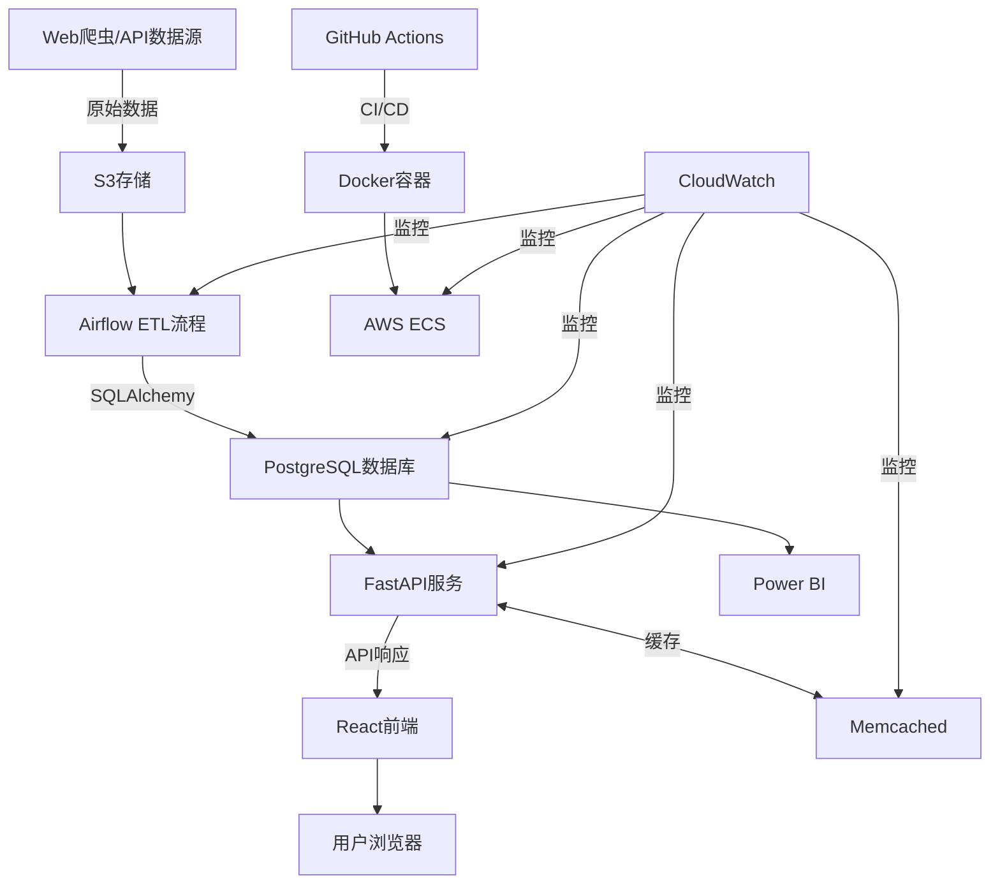

# NBA Fantasy Analytics Platform 技术栈决策文档

## 概述

本文档记录了NBA Fantasy Analytics Platform项目的技术栈决策过程，包括每项技术的选择原因、考虑的替代方案以及具体实施细节。该技术栈旨在支持一个高性能、可扩展的Fantasy篮球分析平台，同时展示与业界需求相符的技术能力。

> **文档关系**：本技术栈决策文档详细阐述了各个技术组件的选择理由和替代方案分析，是技术选型的权威参考。它与[架构设计文档](1-architecture.md)相辅相成，架构文档提供系统整体结构视图，而本文档提供各技术详细选型依据。具体的实现细节可参考[ETL Pipeline文档](2-ETL-Pipeline.md)、[数据模型文档](3-database-schema.md)、[缓存策略文档](4-caching-strategy.md)和[运维策略文档](5-operations.md)，而系统实施计划请参考[实施路线图](7-implementation-roadmap.md)。

## 核心技术栈决策

### 1. 数据库: PostgreSQL

**选择原因**:
- 开源免费，无需额外许可成本
- 强大的分析功能和复杂查询支持
- 优秀的JSON/JSONB支持，适合处理半结构化数据
- 丰富的索引类型(B-tree, GIN, GiST, BRIN)
- 可靠的事务支持和ACID合规性
- 与AWS RDS良好集成，简化运维
- 物化视图支持，优化查询性能

**考虑的替代方案**:
- **MySQL/MariaDB**: 虽然也是流行的开源选择，但PostgreSQL提供更强大的分析功能和更丰富的数据类型
- **MS SQL Server**: 提供强大功能但有许可费用，不符合开源优先的选择原则
- **MongoDB**: NoSQL数据库适合处理非结构化数据，但项目需要关系型模型和复杂查询能力
- **Amazon Aurora**: 兼容PostgreSQL但成本更高，可作为未来扩展选项

**实施细节**:
- 使用PostgreSQL 14版本
- 在AWS RDS上部署，启用Multi-AZ高可用配置
- 配置适当的参数组，优化内存使用
- 利用声明式分区管理大型表
- 实施有效的索引策略和定期维护计划

### 2. ORM框架: SQLAlchemy

**选择原因**:
- Python生态系统中最成熟的ORM框架
- 支持声明式和命令式风格
- 提供灵活的查询构建和表达式语言
- 优秀的事务管理和会话处理
- 完全支持PostgreSQL特性
- 活跃的社区和广泛的文档

**考虑的替代方案**:
- **Django ORM**: 与Django框架耦合度高，不适合独立使用
- **Peewee**: 更轻量但功能较少，不适合复杂查询
- **Raw SQL**: 直接灵活但缺乏类型安全和对象映射

**实施细节**:
- 使用SQLAlchemy 2.0版本
- 采用声明式映射定义模型
- 实现数据库迁移工具(Alembic)
- 优化批量操作和连接池配置
- 利用异步支持提升并发性能

### 3. 后端语言: Python

**选择原因**:
- 强大的数据处理和分析能力
- 丰富的机器学习和科学计算库
- 简洁易读的语法，提高开发效率
- 广泛使用于数据科学和Web开发领域
- 庞大的开源生态系统
- 跨平台兼容性

**考虑的替代方案**:
- **Java/Scala**: 更强的类型系统但开发速度较慢
- **JavaScript/Node.js**: 前后端统一但数据处理不如Python强大
- **Go**: 高性能但生态系统在数据科学方面不如Python成熟

**实施细节**:
- 使用Python 3.10版本
- 采用虚拟环境和依赖管理(Poetry)
- 实施类型提示和静态类型检查
- 采用模块化设计
- 使用异步编程提高I/O密集型操作性能

### 4. ETL工具: Apache Airflow

**选择原因**:
- 行业标准的工作流编排工具
- 灵活的任务调度和依赖管理
- 强大的监控和错误处理能力
- 与Python和AWS良好集成
- 支持动态工作流生成
- 提供丰富的操作界面

**考虑的替代方案**:
- **Luigi**: 更轻量但功能较少，监控功能有限
- **AWS Glue**: 托管ETL服务但配置灵活性较低
- **Prefect**: 现代替代品但社区规模较小
- **自定义脚本**: 控制度高但需要自行实现调度和监控

**实施细节**:
- 使用Airflow 2.5版本
- 在Docker容器中部署
- 使用LocalExecutor用于开发，CeleryExecutor用于生产
- 实现自定义Operators和Sensors
- 设计模块化的DAG结构
- 与AWS服务集成(S3, RDS等)

### 5. API框架: FastAPI

**选择原因**:
- 现代、高性能的异步Python API框架
- 自动API文档生成(OpenAPI和Swagger UI)
- 基于Python类型提示的数据验证
- 提供依赖注入系统
- 优秀的异步支持
- 易于集成JWT认证和权限管理

**考虑的替代方案**:
- **Flask**: 成熟但没有内置异步支持
- **Django REST Framework**: 功能强大但与Django框架绑定
- **Starlette**: FastAPI的基础框架，功能更少但性能相当

**实施细节**:
- 使用FastAPI最新版本
- 实现RESTful API设计
- 采用Pydantic模型进行数据验证
- 配置JWT认证和基于角色的访问控制
- 实施请求限流和缓存策略
- 使用Docker容器部署

### 6. 机器学习框架: Scikit-learn & PyTorch

**选择原因**:
- **Scikit-learn**: 
  - 提供丰富的经典机器学习算法
  - 统一的API设计
  - 完善的数据预处理工具
  - 易于与Pandas集成
  
- **PyTorch**:
  - 提供更直观的Pythonic接口
  - 动态计算图便于调试
  - 灵活的模型构建
  - 优秀的研究生态系统
  - 适合快速原型设计和实验

**考虑的替代方案**:
- **TensorFlow**: 功能强大但API不如PyTorch直观
- **XGBoost/LightGBM**: 针对梯度提升树专门优化，可作为补充而非替代
- **Keras**: 高级API但灵活性较低

**实施细节**:
- Scikit-learn用于特征工程和基础模型
- PyTorch用于深度学习模型
- 建立标准化的模型训练和评估流程
- 实现模型版本控制和A/B测试框架
- 设计模型部署和监控机制

### 7. 可视化工具: Power BI

**选择原因**:
- 强大的商业智能和数据可视化能力
- 与PostgreSQL良好的兼容性
- 简单的拖放式界面，易于非技术用户使用
- 支持交互式仪表板和报表
- 内置ETL功能(Power Query)
- 符合求职技能需求

**考虑的替代方案**:
- **Tableau**: 功能强大但价格较高
- **Grafana**: 开源但商业智能能力不如Power BI
- **Python可视化库(Plotly/Dash)**: 更灵活但需要更多开发工作
- **Looker**: 强大但成本高且学习曲线陡

**实施细节**:
- 使用PostgreSQL ODBC连接器配置数据源
- 创建星型模式的数据模型
- 设计交互式仪表板
- 实现增量数据刷新策略
- 配置适当的权限和共享机制

### 8. 前端框架: React

**选择原因**:
- 组件化设计便于代码复用
- 虚拟DOM提高性能
- 丰富的生态系统和组件库
- 单向数据流使状态管理更可预测
- 大型社区支持和广泛的文档
- 支持服务器端渲染和静态站点生成

**考虑的替代方案**:
- **Angular**: 功能全面但学习曲线陡峭
- **Vue.js**: 易于学习但生态系统相对较小
- **Svelte**: 新兴框架但社区规模较小

**实施细节**:
- 使用Create React App或Next.js构建项目
- 采用Typescript提供类型安全
- 使用Redux或Context API进行状态管理
- 集成Material-UI或Ant Design组件库
- 实现响应式设计
- 集成图表库(如Recharts, Nivo)

### 9. 云平台: AWS

**选择原因**:
- 市场领先的云服务提供商
- 提供全面的服务生态系统
- 弹性扩展能力
- 强大的安全和合规功能
- 完善的监控和成本管理工具
- 广泛的文档和社区支持

**考虑的替代方案**:
- **Azure**: 微软平台与Power BI集成良好但总体成本可能更高
- **Google Cloud**: 提供强大的数据处理功能但服务选择不如AWS广泛
- **自托管基础设施**: 控制度高但管理复杂度增加

**实施细节**:
- 核心服务: EC2, RDS, S3, ElastiCache, ALB
- 使用Terraform实现基础设施即代码
- 配置多可用区部署确保高可用性
- 实施适当的安全组和IAM策略
- 使用CloudWatch进行监控和告警
- 配置成本预算和警报

### 10. 缓存: Memcached

**选择原因**:
- 免费开源的分布式内存对象缓存系统
- 简单高效的键值存储
- 低开销，资源占用少，适合个人项目
- 易于配置和使用
- 良好的横向扩展能力
- 与Python和FastAPI轻松集成
- 在AWS上可通过ElastiCache for Memcached使用

**考虑的替代方案**:
- **Redis**: 功能更丰富但资源占用较多
- **PostgreSQL materialized views**: 对于某些场景可作为缓存机制

**实施细节**:
- **本地开发环境**:
  - 使用Docker容器运行Memcached服务
  - 轻量级配置适合本地开发
  - 简化设置便于快速开发迭代

- **AWS生产/测试环境**:
  - 使用AWS ElastiCache for Memcached服务（ElastiCache是AWS提供的托管Memcached服务）
  - 利用AWS Free Tier降低成本
  - 根据环境需求选择适当的节点类型和配置
  - 与其他AWS服务无缝集成

- **通用实施策略**:
  - 实现多级缓存策略
  - 配置适当的过期策略
  - 用于API响应缓存和频繁查询结果缓存
  - 监控缓存命中率和内存使用

### 11. 容器化: Docker & Docker Compose

**选择原因**:
- 提供一致的开发和生产环境
- 简化依赖管理和部署流程
- 支持微服务架构
- 提高资源利用效率
- 便于CI/CD集成
- 容器编排与扩展能力

**考虑的替代方案**:
- **虚拟机**: 更强的隔离但资源效率较低
- **直接部署**: 更简单但环境一致性难以保证
- **AWS Lambda**: 无服务器部署但并非所有组件都适合

**实施细节**:
- 多阶段构建优化镜像大小
- 使用Docker Compose管理本地开发环境
- 实现健康检查和重启策略
- 配置适当的数据卷和持久化策略
- 在AWS ECS上部署生产环境
- 实践最小权限原则

### 12. CI/CD: GitHub Actions

**选择原因**:
- 与GitHub代码仓库紧密集成
- 简化的YAML配置
- 灵活的工作流定义
- 丰富的预置动作和市场
- 完全托管，无需额外基础设施
- 提供矩阵构建和并行作业

**考虑的替代方案**:
- **Jenkins**: 功能强大但需要自行维护服务器
- **AWS CodePipeline**: 与AWS服务集成但灵活性较低
- **CircleCI/Travis CI**: 成熟的托管CI服务但与GitHub集成不如Actions紧密

**实施细节**:
- 配置多环境部署工作流(开发、测试、生产)
- 实现代码质量检查(linting, type checking)
- 自动化测试(单元测试、集成测试)
- 配置Docker镜像构建和发布
- 实施基础设施部署(Terraform)
- 设置数据库迁移自动化

## 监控与日志决策

### 选择AWS CloudWatch作为主要监控工具

**选择原因**:
- 与AWS服务原生集成
- 提供日志管理、指标监控和告警功能
- 无需额外维护基础设施
- 配置简单，上手容易
- 支持自定义指标和仪表板
- 成本与其他AWS服务一致

**考虑的替代方案**:
- **Prometheus & Grafana**: 更灵活强大但需要自行维护
- **Datadog**: 功能全面但成本较高
- **ELK Stack**: 强大的日志分析但配置和维护复杂

**实施细节**:
- 集成EC2、RDS、Lambda等AWS服务的指标
- 配置应用程序自定义指标
- 设置关键指标的告警阈值
- 实现日志集中存储和分析
- 创建自定义仪表板
- 配置适当的日志保留策略

## 技术栈集成策略

### 数据流与组件交互

### 技术栈兼容性考量

1. **PostgreSQL & SQLAlchemy**:
   - 完全兼容，SQLAlchemy提供全面的PostgreSQL特性支持
   - 利用PostgreSQL JSON/JSONB、数组、物化视图等高级功能

2. **Python & PyTorch**:
   - 原生集成，PyTorch是Python优先的深度学习框架
   - 与NumPy和Pandas无缝协作

3. **FastAPI & Memcached**:
   - 通过pymemcache或pylibmc库集成
   - 实现响应缓存和速率限制

4. **Docker & GitHub Actions**:
   - 内置支持Docker构建和发布
   - 通过多阶段CI/CD流程实现高效部署

5. **AWS & CloudWatch**:
   - 原生集成，提供完整的监控覆盖
   - 支持自定义指标和告警触发器

## 版本和兼容性管理

| 技术 | 版本 | 兼容性约束 |
|------|------|------------|
| Python | 3.10 | 最低要求3.8+ |
| PostgreSQL | 14 | 最低要求12+ |
| SQLAlchemy | 2.0 | 最低要求1.4+ |
| FastAPI | 0.95+ | 依赖Python 3.7+ |
| React | 18 | 最低要求16+ |
| Docker | 20.10+ | 支持BuildKit |
| PyTorch | 2.0 | 最低要求1.10+ |
| Memcached | 1.6+ | 最低要求1.4+ |
| Power BI | 最新服务版本 | 桌面版最低为2022年5月发布 |

## 开发与部署管理

### 环境策略

1. **本地开发环境**:
   - Docker Compose管理所有服务
   - 卷映射实现代码热重载
   - 使用开发配置(调试模式，详细日志)

2. **CI环境**:
   - GitHub Actions执行测试和验证
   - 使用模拟数据和测试数据库
   - 包含静态代码分析和安全扫描

3. **测试环境**:
   - 完整AWS部署但规模较小
   - 使用匿名化的生产数据克隆
   - 自动部署和测试

4. **生产环境**:
   - 多可用区高可用配置
   - 严格的安全设置和访问控制
   - 手动批准部署流程

### 安全考量

1. **数据安全**:
   - PostgreSQL数据加密(静态和传输中)
   - S3对象加密
   - API密钥和凭证管理(AWS Secrets Manager)

2. **应用安全**:
   - HTTPS/TLS加密
   - JWT认证和授权
   - 输入验证和防护
   - CSRF和XSS防护

3. **基础设施安全**:
   - VPC隔离和安全组
   - 最小权限IAM策略
   - 容器镜像安全扫描
   - 定期更新和补丁

## 未来扩展与技术演进

1. **短期扩展**:
   - PostgreSQL分区和索引优化
   - Memcached缓存策略优化
   - Docker容器资源分配调优

2. **中期扩展**:
   - 引入实时数据处理(Kafka/Kinesis)
   - 添加推荐系统功能
   - 扩展Power BI报表集

3. **长期规划**:
   - 考虑引入图数据库组件
   - 评估无服务器架构潜力
   - 探索高级机器学习模型集成

## 结论

NBA Fantasy Analytics Platform的技术栈选择基于项目需求、技术成熟度、团队熟悉程度以及业界趋势的全面考量。我们选择了以PostgreSQL为中心的数据管理方案，结合Python生态系统的强大工具链，采用现代的DevOps实践和容器化技术，部署在灵活可扩展的AWS云平台上。

该技术栈不仅满足当前项目需求，还为未来功能扩展和性能优化提供了充分的灵活性。通过持续评估和适应新兴技术，我们将确保系统保持现代化和高效率。 

> **补充说明**：本文档重点阐述了技术选型的决策过程和理由，为项目技术基础提供了参考依据。关于这些技术如何在系统中协同工作，请参考[架构设计文档](1-architecture.md)；有关详细实现方法，请查阅专项文档：[ETL Pipeline文档](2-ETL-Pipeline.md)（数据处理流程）、[数据模型文档](3-database-schema.md)（数据库设计）、[缓存策略文档](4-caching-strategy.md)（性能优化）和[运维策略文档](5-operations.md)（部署与维护）。项目实施计划请参考[实施路线图](7-   implementation-roadmap.md)。 