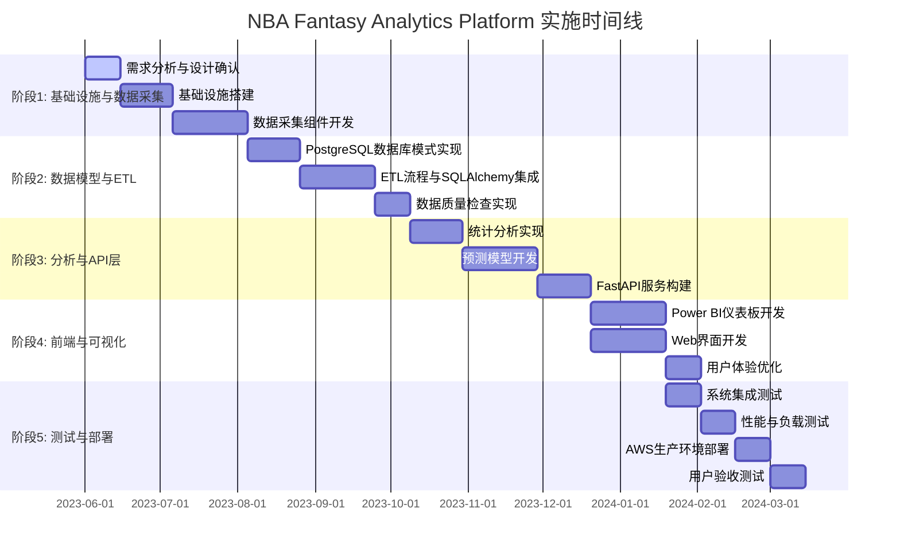

# NBA Fantasy Analytics Platform 实施路线图

## 路线图概述

本文档概述了NBA Fantasy Analytics Platform从初始开发到生产部署的实施计划。我们采用迭代开发方法，将整个项目分为多个阶段，每个阶段都有明确的目标和可交付成果。

> **文档关系**：本实施路线图文档提供了项目开发和部署的时间线规划。它直接基于[需求文档](0-requirements.md)中定义的功能和非功能需求，将这些需求转化为可实施的计划和任务。路线图按照[架构设计](1-architecture.md)中定义的系统结构和[技术栈决策文档](6-tech-stack-decisions.md)中确定的技术选择来安排实施步骤。路线图包含了专项文档中设计内容的实施计划，涵盖[ETL Pipeline](2-ETL-Pipeline.md)的开发、[数据模型](3-database-schema.md)的实现、[缓存策略](4-caching-strategy.md)的部署以及[运维策略](5-operations.md)的执行，为整个项目提供了清晰的实施框架。

### 项目目标

1. 建立端到端的Fantasy篮球数据分析平台
2. 提供准确的球员表现预测和阵容优化建议
3. 创建直观的数据可视化和仪表板
4. 确保系统的可扩展性、性能和安全性
5. 实现自动化的数据采集和处理流程

## 阶段划分与时间线

项目总体预计耗时6个月，分为以下5个主要阶段：

## 阶段1: 基础设施与数据采集 (2个月)

### 目标
建立开发环境和云基础设施，实现NBA数据的可靠采集。

### 任务

#### 第1-2周: 需求分析与设计确认
- [✓] 确认并细化需求文档
- [✓] 最终确定技术栈选择
- [✓] 完成系统架构设计文档
- [✓] 建立开发规范和Git工作流

#### 第3-5周: 基础设施搭建
##### 本地开发环境（优先）
- [ ] 设置本地开发环境（Docker Compose）
- [ ] 创建初始代码库结构（按架构文档规划）
- [ ] 设置开发工具配置（编辑器设置、linters、pre-commit钩子）

##### AWS基础设施配置
- [ ] 使用Terraform配置AWS开发环境基础设施
- [ ] 配置多环境架构（开发、测试、生产分离）
- [ ] 配置网络架构（VPC、子网、安全组）
- [ ] 配置RDS PostgreSQL实例和参数组设置
- [ ] 设置S3存储桶（原始数据、处理后数据、备份）
- [ ] 配置ElastiCache for Memcached服务（利用AWS Free Tier）

##### 安全配置
- [ ] 配置IAM角色和策略（基于最小权限原则）
- [ ] 设置AWS Secrets Manager用于凭证管理
- [ ] 实现安全基线配置和合规检查

##### 数据库与迁移
- [ ] 实现初始数据库迁移脚本（Alembic）
- [ ] 配置数据库版本控制策略
- [ ] 设置数据库测试环境

##### CI/CD与自动化
- [ ] 配置CI/CD流水线（GitHub Actions）
- [ ] 实现自动化测试集成
- [ ] 配置部署自动化流程

##### 监控与运维
- [ ] 实现基础监控和日志系统（CloudWatch）
- [ ] 配置告警和通知机制
- [ ] 设置备份与恢复策略
- [ ] 实现基础运维自动化脚本

#### 第6-9周: 数据采集组件开发
- [ ] 开发Basketball-Reference网站爬虫
- [ ] 开发NBA官方API连接器
- [ ] 实现增量数据提取逻辑
- [ ] 开发数据验证组件和数据清洗流程
- [ ] 创建采集调度机制（Airflow DAGs）
- [ ] 实现原始数据存储到S3和初步导入PostgreSQL

### 里程碑与交付物
- ✓ 完整的AWS基础设施部署（RDS PostgreSQL, EC2, S3等）
- ✓ 能够自动收集NBA数据的爬虫系统，支持增量采集
- ✓ 初始数据模型和SQLAlchemy基础类
- ✓ 数据采集的测试覆盖率>85%
- ✓ 基础设施即代码（IaC）文档和脚本
- ✓ Docker容器化开发环境配置
- ✓ 完整的安全配置和合规文档
- ✓ 多环境部署和测试证明文档
- ✓ 监控和告警配置完成

## 阶段2: 数据模型与ETL (2个月)

### 目标
实现稳定的ETL流程和星型数据模型，充分利用PostgreSQL和SQLAlchemy的优势。

### 任务

#### 第10-12周: PostgreSQL数据库模式实现
- [ ] 使用SQLAlchemy实现完整ORM模型
- [ ] 创建维度表和事实表（球员、球队、比赛、表现等）
- [ ] 设计并实现PostgreSQL分区策略（按季节、月份等）
- [ ] 配置PostgreSQL特有索引（B-tree, GIN, BRIN等）
- [ ] 实现Alembic版本控制和迁移脚本
- [ ] 创建测试数据集和数据库种子脚本

#### 第13-16周: ETL流程与SQLAlchemy集成
- [ ] 开发数据转换组件
- [ ] 实现SQLAlchemy批量插入和UPSERT优化
- [ ] 配置Airflow DAGs和运行器
- [ ] 实现增量和全量加载策略
- [ ] 开发PostgreSQL物化视图刷新机制
- [ ] 实现ETL监控和自动重试机制

#### 第17-18周: 数据质量检查实现
- [ ] 开发数据质量规则引擎
- [ ] 实现基于SQLAlchemy的数据验证器
- [ ] 创建数据质量控制台和仪表板
- [ ] 设置质量问题告警和通知机制
- [ ] 开发数据血缘追踪功能

### 里程碑与交付物
- ✓ 完整实现的PostgreSQL星型模式数据仓库
- ✓ SQLAlchemy ORM模型文档和示例
- ✓ 自动化的ETL流程，支持增量和全量加载
- ✓ 物化视图和查询优化策略文档
- ✓ 每日数据质量报告和监控仪表板

## 阶段3: 分析与API层 (2个月)

### 目标
构建预测模型和API服务，为前端和Power BI提供数据访问。

### 任务

#### 第19-21周: 统计分析实现
- [ ] 开发球员表现统计分析组件
- [ ] 创建Fantasy得分计算引擎
- [ ] 使用PostgreSQL分析函数实现高级统计
- [ ] 实现对阵分析和相关性分析
- [ ] 建立历史绩效趋势分析
- [ ] 设计并实现PostgreSQL存储过程优化

#### 第22-25周: 预测模型开发
- [ ] 开发特征工程组件（使用SQLAlchemy和Pandas）
- [ ] 构建球员表现预测模型（使用Scikit-learn/PyTorch）
- [ ] 实现基于PyTorch的深度学习预测模型
- [ ] 实现阵容优化算法
- [ ] 创建模型评估和监控框架
- [ ] 实现模型再训练流程和版本控制
- [ ] 开发模型部署流水线

#### 第26-28周: FastAPI服务构建
- [ ] 使用FastAPI构建RESTful API
- [ ] 集成SQLAlchemy会话和查询优化
- [ ] 实现JWT认证和RBAC授权机制
- [ ] 创建交互式API文档和示例
- [ ] 开发Memcached缓存层集成
- [ ] 实现API性能监控和日志记录
- [ ] 配置Docker容器化API服务部署

### 里程碑与交付物
- ✓ 完整的统计分析模块，包含PostgreSQL优化查询
- ✓ 能够预测球员表现的机器学习模型，准确率>75%
- ✓ 阵容优化系统的初始版本
- ✓ 功能完备的FastAPI服务，包含自动文档
- ✓ API性能测试报告，响应时间<200ms

## 阶段4: 前端与可视化 (1个月)

### 目标
创建直观的用户界面和数据可视化。

### 任务

#### 第29-32周: Power BI仪表板开发
- [ ] 配置PostgreSQL与Power BI的ODBC连接
- [ ] 开发球员分析仪表板
- [ ] 创建球队对比仪表板
- [ ] 构建Fantasy积分预测仪表板
- [ ] 实现自定义可视化和高级筛选器
- [ ] 创建数据刷新和缓存策略

#### 第29-32周: Web界面开发 (与Power BI并行)
- [ ] 设计并实现响应式用户界面
- [ ] 开发球员浏览和比较功能
- [ ] 创建阵容构建和优化工具
- [ ] 实现用户数据管理功能
- [ ] 集成API服务和认证系统
- [ ] 开发数据导出和共享功能

#### 第33-34周: 用户体验优化
- [ ] 进行用户测试和可用性评估
- [ ] 优化移动端体验
- [ ] 提高页面加载性能和API响应时间
- [ ] 实现个性化设置和推荐
- [ ] 添加主题切换和无障碍功能

### 里程碑与交付物
- ✓ 完整的Power BI仪表板套件，包含连接指南
- ✓ 功能全面的Web应用，响应式设计
- ✓ 用户体验测试报告和改进计划
- ✓ 性能优化报告，包含页面加载速度

## 阶段5: 测试与部署 (1个月)

### 目标
确保系统稳定可靠，并成功部署到生产环境。

### 任务

#### 第35-36周: 系统集成测试
- [ ] 执行端到端集成测试
- [ ] 验证所有子系统之间的交互
- [ ] 测试PostgreSQL数据库性能和连接池配置
- [ ] 测试错误处理和恢复机制
- [ ] 修复发现的缺陷和兼容性问题

#### 第37-38周: 性能与负载测试
- [ ] 设计并执行负载测试场景
- [ ] 优化PostgreSQL查询和索引结构
- [ ] 测试API服务的并发处理能力
- [ ] 验证缓存策略的有效性
- [ ] 优化发现的系统瓶颈
- [ ] 调整PostgreSQL配置参数

#### 第39-40周: AWS生产环境部署
- [ ] 配置生产RDS PostgreSQL（Multi-AZ部署）
- [ ] 执行数据迁移和初始化
- [ ] 部署API服务和Web前端
- [ ] 设置CloudWatch监控和告警
- [ ] 配置自动备份和灾难恢复策略
- [ ] 创建运维手册和部署文档
- [ ] 设置GitHub Actions持续部署流程
- [ ] 配置Docker容器化服务在ECS上的部署

#### 第41-42周: 用户验收测试
- [ ] 进行内部用户验收测试
- [ ] 收集并处理反馈
- [ ] 实施必要的调整和修复
- [ ] 准备用户指南和培训材料
- [ ] 计划正式发布

### 里程碑与交付物
- ✓ 完整的测试报告，包括性能测试结果
- ✓ PostgreSQL性能优化文档
- ✓ 部署在生产环境的完整系统
- ✓ 系统监控仪表板和告警配置
- ✓ 运维手册和用户文档

## 资源需求

### 团队组成
- 1x 项目经理/产品负责人
- 2x 后端开发工程师（Python/PostgreSQL/SQLAlchemy专家）
- 1x 数据工程师（ETL/Airflow专家）
- 1x 数据科学家（机器学习/PyTorch专家）
- 1x 前端开发工程师（React）
- 1x DevOps工程师（AWS/Terraform/Docker专家）
- 1x QA工程师

### 基础设施（AWS）
- **计算资源**:
  - EC2实例：开发环境 (2x t3.micro, Free Tier)
  - 生产环境 (2-4x t3.micro + Auto Scaling)
  - ECS集群（容器化服务）

- **数据库**:
  - RDS PostgreSQL：开发/生产 (db.t3.micro, Free Tier)
  - 可考虑升级到db.t3.small（超出Free Tier）
  - 只读副本根据需要添加

- **存储与缓存**:
  - S3存储：约100GB （原始数据和备份）
  - ElastiCache：cache.t3.micro (Free Tier)
  - 优化缓存策略以适应Free Tier限制

- **网络与安全**:
  - Application Load Balancer
  - VPC、安全组和IAM角色配置
  - WAF和Shield（安全防护）

- **监控与管理**:
  - CloudWatch监控和日志
  - Prometheus + Grafana（详细指标）
  - AWS Secrets Manager（密钥管理）

## 风险与缓解策略

| 风险 | 可能性 | 影响 | 缓解策略 |
|------|-------|------|---------|
| 数据源变更或API限制 | 中 | 高 | 1. 建立数据源监控系统 2. 设计模块化数据采集器 3. 准备多个备用数据源 4. 实现数据缓存和节流机制 |
| PostgreSQL性能瓶颈 | 中 | 高 | 1. 定期进行EXPLAIN分析 2. 实施表分区和索引优化 3. 配置恰当的PostgreSQL参数 4. 使用只读副本分担读取负载 |
| PyTorch模型训练资源不足 | 中 | 中 | 1. 实施高效的模型架构 2. 采用增量训练策略 3. 利用GPU加速训练 4. 优化模型规模与准确性的平衡 |
| 预测模型精度不足 | 中 | 高 | 1. 早期开始模型验证 2. 采用集成学习和模型组合 3. 定期重新训练模型 4. 建立A/B测试框架 |
| ETL流程失败或延迟 | 中 | 中 | 1. 实现健壮的错误处理 2. 设置监控和自动重试 3. 冗余调度和灾备策略 4. 优化批处理性能 |
| Docker容器化部署问题 | 低 | 中 | 1. 开发与生产环境一致性保障 2. 严格的镜像版本控制 3. 自动化测试集成到CI/CD流程 4. 容器健康检查和自动恢复 |
| GitHub Actions配置错误 | 低 | 中 | 1. 使用环境隔离防止生产环境意外部署 2. 实施严格的流程审查 3. 模拟测试环境验证CI/CD流程 4. 回滚机制设计 |
| AWS成本超预算 | 低 | 中 | 1. 设置成本告警和预算 2. 使用自动缩放和保留实例 3. 定期审查资源使用效率 4. 实施非关键时段关闭策略 |
| 数据安全和隐私问题 | 低 | 高 | 1. 实施全面的数据加密 2. 定期安全审计和渗透测试 3. 严格的访问控制和最小权限 4. 合规性检查和文档 |

## 依赖关系

### 内部依赖
- 数据采集组件必须先于ETL流程开发完成
- PostgreSQL数据模型必须在预测模型开发前实现
- SQLAlchemy ORM模型需在API服务构建前完成
- API服务需要在Web界面开发前完成基本功能
- 系统集成测试依赖于所有组件的基本完成

### 外部依赖
- AWS基础设施可用性和配额限制
- PostgreSQL版本兼容性（要求14.0+）
- 数据源（如Basketball-Reference）的稳定性和API可访问性
- Power BI与PostgreSQL的连接兼容性
- 第三方库和框架的更新和安全补丁

## 成功指标

### 技术指标
- **性能**:
  - API响应时间：95%的请求 < 200ms
  - PostgreSQL查询执行时间：复杂查询 < 1秒
  - ETL完整运行时间：< 30分钟

- **可靠性**:
  - 系统可用性：> 99.9%
  - 数据刷新延迟：< 6小时
  - 故障恢复时间：< 30分钟

- **质量**:
  - 测试覆盖率：> 80%
  - 预测准确率：> 75%（根据具体模型调整）
  - 代码质量指标达标

### 业务指标
- 用户注册数：前3个月达到500名活跃用户
- 用户留存率：> 60%（30天后）
- 用户满意度：> 4.0/5.0（根据调查）
- Fantasy联赛表现改善：使用系统的用户比不使用的用户表现提高20%
- 每周活跃用户增长率：> 10%

## 后续规划

成功上线第一版后，以下功能将纳入未来迭代：

### 近期规划（3-6个月）
- 实时数据更新功能
- 移动应用开发（iOS/Android）
- 高级数据分析功能扩展
- 用户个性化推荐系统
- PostgreSQL时序数据扩展

### 中期规划（6-12个月）
- 社区功能和用户交互
- 更深入的对阵分析和比赛预测
- 与真实Fantasy平台的API集成
- 国际市场本地化
- 高级数据可视化和定制报表

### 长期规划（12个月以上）
- 扩展到其他体育项目（足球、棒球等）
- 高级订阅服务模式
- 建立数据分析API生态系统
- 人工智能驱动的个性化Fantasy顾问

## 结论

本实施路线图为NBA Fantasy Analytics Platform提供了从初始开发到生产部署的清晰规划，分阶段实施策略有助于项目风险管理和资源分配优化。通过明确的时间线和可衡量的里程碑，项目团队可以有效跟踪进度并进行必要的调整。

路线图将随项目进展持续更新，吸收来自各个开发阶段的反馈和经验教训。成功实施本路线图将确保平台的技术健壮性、业务价值实现和用户满意度，为Fantasy篮球玩家提供数据驱动的决策支持工具。

> **补充说明**：本路线图应结合其他专项文档一起阅读，首先是[需求文档](0-requirements.md)，它定义了系统应实现的功能和特性，是路线图规划的基础。同时还应参考[架构设计](1-architecture.md)和[技术栈决策文档](6-tech-stack-decisions.md)，以全面理解项目的实施计划。各阶段具体技术实现细节请参考相应专项文档：[ETL Pipeline文档](2-ETL-Pipeline.md)、[数据模型文档](3-database-schema.md)、[缓存策略文档](4-caching-strategy.md)和[运维策略文档](5-operations.md)。

