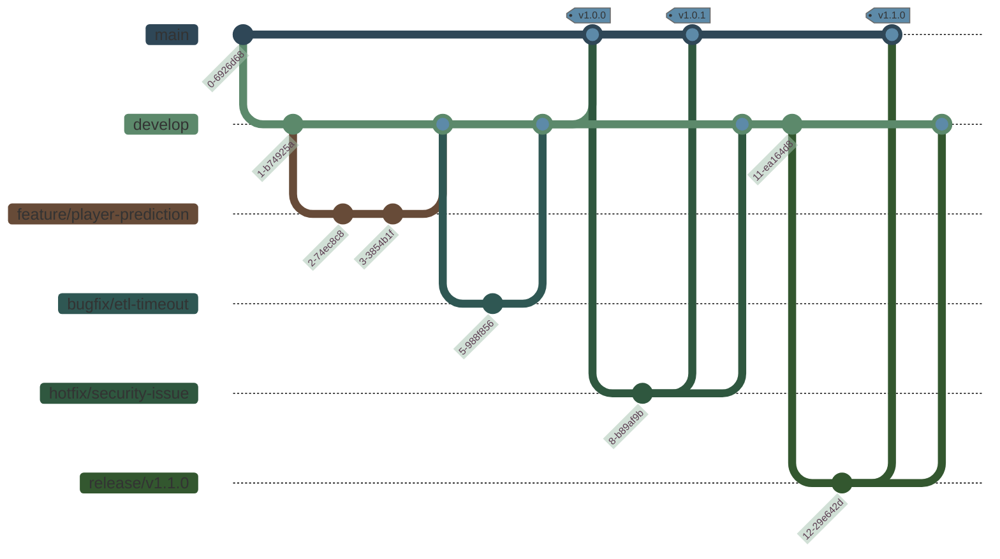

# NBA Fantasy Analytics Platform 开发规范与 Git 工作流

## 概述

本文档为 NBA Fantasy Analytics Platform 项目定义了开发规范和 Git 工作流程，旨在建立一致的开发标准，提高协作效率，确保代码质量，并简化集成和部署流程。所有团队成员应遵循这些规范，确保项目开发的一致性和可维护性。

> **文档关系**：本开发规范文档基于[技术栈决策文档](6-tech-stack-decisions.md)中确定的技术选择，并与[运维策略文档](5-operations.md)中定义的 CI/CD 流程和环境管理策略紧密关联。它为实现[架构设计](1-architecture.md)中描述的系统结构提供了具体的开发指导。实施过程应参考[实施路线图](7-implementation-roadmap.md)中的项目阶段和里程碑。本文档中的规范适用于所有组件的开发，包括[ETL Pipeline](2-ETL-Pipeline.md)、[数据模型](3-database-schema.md)和应用层服务。

## 1. 代码风格与格式规范

### 1.1 Python 代码规范

- 遵循[PEP 8](https://www.python.org/dev/peps/pep-0008/)风格指南
- 使用[Black](https://github.com/psf/black)进行自动代码格式化，配置行长度为 88 字符
- 使用[isort](https://pycqa.github.io/isort/)对导入进行排序
- 使用[Flake8](https://flake8.pycqa.org/)进行代码质量检查
- 使用[mypy](http://mypy-lang.org/)进行静态类型检查
- 文档字符串使用[Google 风格](https://sphinxcontrib-napoleon.readthedocs.io/en/latest/example_google.html)

**代码示例**:

```python
# 推荐的Python代码风格示例
from typing import Dict, List, Optional

import pandas as pd
from fastapi import APIRouter, Depends
from sqlalchemy.orm import Session

from app.database.session import get_db
from app.models.player import Player
from app.schemas.player import PlayerCreate, PlayerResponse


class PlayerService:
    """服务类用于处理球员相关业务逻辑。

    该类实现了球员数据的CRUD操作，并包含与Fantasy得分相关的计算逻辑。
    """

    def __init__(self, db: Session):
        """初始化PlayerService。

        Args:
            db: 数据库会话
        """
        self.db = db

    def get_players(self, skip: int = 0, limit: int = 100) -> List[Player]:
        """获取球员列表。

        Args:
            skip: 跳过的记录数
            limit: 返回的最大记录数

        Returns:
            球员对象列表
        """
        return self.db.query(Player).offset(skip).limit(limit).all()
```

### 1.2 JavaScript/TypeScript 代码规范

- 使用[TypeScript](https://www.typescriptlang.org/)提供类型安全
- 使用[ESLint](https://eslint.org/)配合[Airbnb 风格指南](https://github.com/airbnb/javascript)
- 使用[Prettier](https://prettier.io/)进行代码格式化
- 使用[React Hooks](https://reactjs.org/docs/hooks-intro.html)而非类组件
- 状态管理使用 React Context API 或 Redux

**代码示例**:

```typescript
// 推荐的TypeScript React组件风格
import React, { useState, useEffect } from "react";
import { useQuery } from "react-query";

interface Player {
  id: number;
  name: string;
  team: string;
  position: string;
  fantasyPoints: number;
}

interface PlayerCardProps {
  playerId: number;
  showDetails?: boolean;
}

export const PlayerCard: React.FC<PlayerCardProps> = ({
  playerId,
  showDetails = false,
}) => {
  const { data, isLoading, error } = useQuery<Player>(
    ["player", playerId],
    () => fetch(`/api/players/${playerId}`).then((res) => res.json())
  );

  if (isLoading) return <div>Loading...</div>;
  if (error) return <div>Error loading player data</div>;
  if (!data) return null;

  return (
    <div className="player-card">
      <h3>{data.name}</h3>
      <div>
        {data.team} - {data.position}
      </div>
      <div>Fantasy Points: {data.fantasyPoints}</div>
      {showDetails && (
        <button type="button" onClick={() => console.log("View details")}>
          View Details
        </button>
      )}
    </div>
  );
};
```

### 1.3 SQL 代码规范

- 关键字大写（SELECT, INSERT, UPDATE 等）
- 表名和字段名使用蛇形命名法（snake_case）
- 使用明确的表别名和字段名（避免`SELECT *`）
- 每个语句块换行以提高可读性
- 使用注释说明复杂查询的目的和逻辑

**代码示例**:

```sql
-- 推荐的SQL查询风格
SELECT
    p.player_id,
    p.full_name,
    t.team_name,
    AVG(s.points) AS avg_points,
    AVG(s.rebounds) AS avg_rebounds,
    AVG(s.assists) AS avg_assists
FROM
    players p
JOIN
    teams t ON p.team_id = t.team_id
JOIN
    player_stats s ON p.player_id = s.player_id
WHERE
    s.game_date >= CURRENT_DATE - INTERVAL '30 days'
    AND p.is_active = TRUE
GROUP BY
    p.player_id,
    p.full_name,
    t.team_name
HAVING
    COUNT(s.game_id) >= 5
ORDER BY
    avg_points DESC
LIMIT 20;
```

### 1.4 YAML 和配置文件规范

- 使用 2 个空格缩进
- 使用描述性注释
- 使用环境变量或参数引用敏感值
- 配置应按逻辑分组和排序

### 1.5 Markdown 文档规范

- 使用标题层级反映文档结构
- 代码块需指定语言
- 使用表格提高数据可读性
- 使用相对链接引用项目内其他文档

## 2. Git 分支管理策略

### 2.1 分支模型

项目采用[GitHub Flow](https://guides.github.com/introduction/flow/)的简化版本，结合部分[GitFlow](https://nvie.com/posts/a-successful-git-branching-model/)元素：

- **main**: 主分支，保持随时可部署到生产环境的状态
- **develop**: 开发分支，集成已完成的特性
- **feature/<feature-name>**: 特性分支，从 develop 分支创建
- **bugfix/<bug-name>**: 缺陷修复分支，从 develop 分支创建
- **hotfix/<hotfix-name>**: 紧急修复分支，从 main 分支创建
- **release/<version>**: 发布分支，从 develop 分支创建，用于准备发布



### 2.2 工作流程

1. **特性开发**:

   - 从`develop`分支创建`feature/<feature-name>`分支
   - 在特性分支上进行开发
   - 完成后创建 Pull Request 到`develop`分支
   - 代码审查通过且 CI 验证通过后合并

2. **缺陷修复**:

   - 从`develop`分支创建`bugfix/<bug-name>`分支
   - 修复完成后创建 Pull Request 到`develop`分支
   - 代码审查通过且 CI 验证通过后合并

3. **紧急修复**:

   - 从`main`分支创建`hotfix/<hotfix-name>`分支
   - 修复完成后创建 Pull Request 到`main`和`develop`分支
   - 代码审查通过且 CI 验证通过后合并
   - 在`main`分支打标签记录版本

4. **版本发布**:
   - 从`develop`分支创建`release/<version>`分支
   - 只允许修复 bug，不添加新功能
   - 准备就绪后创建 Pull Request 到`main`分支
   - 代码审查通过且 CI 验证通过后合并
   - 在`main`分支打标签记录版本，同时合并回`develop`分支

### 2.3 分支命名规范

- 使用小写字母和连字符
- 简洁但有描述性
- 包含问题/任务编号（如适用）

**示例**:

- `feature/player-prediction-model`
- `bugfix/fix-etl-pipeline-timeout`
- `hotfix/security-vulnerability-jwt`
- `release/v1.0.0`

## 3. 提交消息规范

采用[Conventional Commits](https://www.conventionalcommits.org/)规范，提交消息格式如下：

```
<类型>[可选的作用域]: <描述>

[可选的正文]

[可选的脚注]
```

### 3.1 类型

- **feat**: 新功能
- **fix**: Bug 修复
- **docs**: 仅文档更改
- **style**: 不影响代码含义的更改（空格、格式化等）
- **refactor**: 既不修复错误也不添加功能的代码更改
- **perf**: 改进性能的代码更改
- **test**: 添加或修正测试
- **build**: 影响构建系统或外部依赖的更改
- **ci**: 对 CI 配置文件和脚本的更改
- **chore**: 其他不修改 src 或 test 文件的更改
- **revert**: 恢复先前的提交

### 3.2 作用域

可选的作用域用于提供额外的上下文信息：

- **api**: API 相关更改
- **db**: 数据库相关更改
- **ui**: 用户界面相关更改
- **auth**: 认证相关更改
- **etl**: ETL 流程相关更改
- **model**: 数据模型相关更改
- **cache**: 缓存策略相关更改
- **infra**: 基础设施相关更改

### 3.3 示例

```
feat(api): 添加球员统计数据端点

添加了新的API端点，允许按日期范围查询球员统计数据。
端点支持分页和过滤选项。

Resolves: #123
```

```
fix(etl): 修复数据导入过程中的日期解析错误

修改了日期字符串解析逻辑，以正确处理不同格式的日期。

Fixes: #456
```

## 4. 代码审查流程

### 4.1 Pull Request 流程

1. 开发者创建 Pull Request，并填写描述模板
2. 自动分配代码审查者
3. CI 流程验证代码质量、测试和构建
4. 审查者提供反馈
5. 开发者根据反馈进行修改
6. 审查者批准更改
7. 管理员或授权人员合并 PR

### 4.2 Pull Request 模板

```markdown
## 描述

[描述这个 PR 的目的和解决的问题]

## 变更类型

- [ ] 新功能
- [ ] Bug 修复
- [ ] 性能改进
- [ ] 代码重构
- [ ] 文档更新
- [ ] 其他：

## 测试

- [ ] 添加了新的单元测试
- [ ] 添加了新的集成测试
- [ ] 所有测试通过

## 相关问题

[关联的问题编号，如 #123]

## 附加说明

[任何需要审查者特别注意的事项]

## 检查清单

- [ ] 代码遵循项目的编码规范
- [ ] 注释清晰且有意义
- [ ] 文档已更新（如适用）
- [ ] 更改已在本地进行测试
```

### 4.3 代码审查标准

- **功能性**: 代码是否实现了预期功能
- **可读性**: 代码是否易于理解
- **可维护性**: 代码结构是否合理，是否易于修改
- **性能**: 代码效率是否足够高
- **安全性**: 是否存在安全漏洞
- **测试覆盖**: 是否有足够的测试覆盖
- **文档**: 是否有充分的文档和注释

### 4.4 审查反馈指南

- 提供具体、建设性的反馈
- 区分必要更改和建议性更改
- 解释原因而不仅是结论
- 保持专业和尊重，关注代码而非开发者

## 5. 测试要求

### 5.1 测试类型

- **单元测试**: 使用 pytest 测试独立组件
- **集成测试**: 测试组件间的交互
- **端到端测试**: 测试完整流程
- **性能测试**: 测试系统在不同负载下的性能

### 5.2 测试覆盖率要求

- 核心业务逻辑: >90%
- API 和服务层: >80%
- 数据访问层: >75%
- 用户界面: >60%

### 5.3 测试命名约定

```
test_<功能>_<场景>_<预期结果>
```

**示例**:

- `test_get_player_stats_valid_id_returns_stats`
- `test_calculate_fantasy_points_missing_data_returns_zero`

### 5.4 测试数据管理

- 使用工厂模式创建测试数据
- 使用 fixture 共享测试资源
- 避免在测试间共享状态
- 使用模拟(mock)隔离外部依赖

## 6. CI/CD 集成

### 6.1 开发者CI/CD指南

本项目使用GitHub Actions实现CI/CD流程，开发者需要了解以下关键方面：

1. **提交代码触发的自动检查**：
   - 代码质量检查（包括Flake8、Mypy、ESLint等）
   - 安全扫描
   - 自动化测试（单元测试、集成测试）
   - 代码覆盖率检查

2. **CI成功标准**：
   - 所有自动化测试通过
   - 代码质量满足预设标准
   - 无安全漏洞发现（或已评估的可接受风险）
   - 代码覆盖率达到最低要求

3. **开发者注意事项**：
   - 提交前在本地运行测试和代码质量检查
   - 仔细检查CI失败原因并及时修复
   - 避免提交会中断主分支构建的代码

> **详细说明**：CI/CD流水线的详细配置、部署流程和环境管理请参阅[运维策略文档](5-operations.md)的"CI/CD自动化部署流程"和"环境分离策略"章节。

### 6.2 本地开发环境配置

为确保开发环境与CI环境一致，开发者应配置本地开发环境：

1. **本地环境设置**：
   - 使用`.env.example`创建本地`.env`文件
   - 设置开发相关的环境变量
   - 使用Docker Compose启动本地开发服务

2. **本地测试执行**：
   - 使用相同的测试命令和配置
   - 配置pre-commit钩子自动运行代码检查

3. **本地验证工具**：
   ```bash
   # 运行代码质量检查
   make lint
   
   # 运行测试
   make test
   
   # 格式化代码
   make format
   ```

> **环境配置参考**：完整的环境配置和管理策略，请参阅[运维策略文档](5-operations.md)中的相关章节。

## 7. 文档更新要求

### 7.1 必要文档

- **API 文档**: 使用 OpenAPI (Swagger)自动生成
- **项目 README**: 项目概述、安装和使用说明
- **设计文档**: 系统架构和组件设计
- **操作手册**: 部署、监控和维护指南

### 7.2 文档更新时机

- 添加新功能时
- 修改现有功能的行为时
- 更改 API 接口时
- 更改配置选项时
- 更改部署流程时

### 7.3 技术文档规范

- 使用 Markdown 格式
- 包含代码示例
- 使用图表说明复杂概念
- 文档应版本化并与代码同步

## 8. 版本控制策略

### 8.1 版本号格式

采用[语义化版本控制](https://semver.org/)，格式为`X.Y.Z`：

- **X**: 主版本号，不兼容的 API 变更
- **Y**: 次版本号，向后兼容的功能性新增
- **Z**: 修订号，向后兼容的问题修正

### 8.2 发布流程

1. 在`release`分支完成最终测试和准备
2. 创建发布说明文档
3. 将`release`分支合并到`main`分支
4. 在`main`分支创建版本标签
5. 执行生产部署流程
6. 将`release`分支合并回`develop`分支

### 8.3 发布说明模板

```markdown
# 版本 X.Y.Z (YYYY-MM-DD)

## 新功能

- 功能 1 描述 (#issue 编号)
- 功能 2 描述 (#issue 编号)

## 改进

- 改进 1 描述 (#issue 编号)
- 改进 2 描述 (#issue 编号)

## Bug 修复

- Bug1 修复描述 (#issue 编号)
- Bug2 修复描述 (#issue 编号)

## 技术变更

- 技术变更 1 描述
- 技术变更 2 描述

## 依赖更新

- 依赖 1: v1.0.0 → v1.1.0
- 依赖 2: v2.0.0 → v2.0.1

## 贡献者

- @contributor1
- @contributor2
```

## 9. 依赖管理

### 9.1 依赖管理策略

- 明确固定依赖版本
- 使用依赖锁定文件(requirements.txt, package-lock.json)
- 定期更新依赖并检查安全漏洞
- 避免使用不活跃或废弃的库

### 9.2 Python 依赖管理

- 使用`requirements`目录组织依赖
  - `base.txt`: 核心依赖
  - `dev.txt`: 开发依赖
  - `prod.txt`: 生产特定依赖
  - `test.txt`: 测试依赖

### 9.3 JavaScript 依赖管理

- 使用`package.json`管理依赖
- 区分`dependencies`和`devDependencies`
- 使用`npm-check-updates`检查更新
- 使用`npm audit`检查安全问题

## 10. 开发环境设置

### 10.1 本地开发环境

开发环境使用 Docker Compose 设置，包含以下服务：

- PostgreSQL 数据库
- Redis 缓存
- Python API 服务
- Web 前端服务
- Airflow 服务

### 10.2 VSCode 配置

推荐使用 VSCode 进行开发，配置`.vscode`目录包含：

- 推荐扩展列表
- 工作区设置
- 启动配置
- 任务配置

### 10.3 代码编辑器配置

```json
// .editorconfig
root = true

[*]
end_of_line = lf
insert_final_newline = true
charset = utf-8
trim_trailing_whitespace = true
indent_style = space

[*.{py,rst,ini}]
indent_size = 4

[*.{js,jsx,ts,tsx,json,yml,yaml,html,css,scss}]
indent_size = 2

[Makefile]
indent_style = tab
```

### 10.4 Git 钩子

使用 pre-commit 配置以下 Git 钩子：

- 代码格式化检查
- 代码语法检查
- 文件权限检查
- 敏感信息检查

```yaml
# .pre-commit-config.yaml
repos:
  - repo: https://github.com/pre-commit/pre-commit-hooks
    rev: v4.4.0
    hooks:
      - id: trailing-whitespace
      - id: end-of-file-fixer
      - id: check-yaml
      - id: check-json
      - id: check-added-large-files
      - id: detect-private-key

  - repo: https://github.com/pycqa/isort
    rev: 5.12.0
    hooks:
      - id: isort
        args: ["--profile", "black"]

  - repo: https://github.com/psf/black
    rev: 23.3.0
    hooks:
      - id: black
        args: ["--line-length", "88"]

  - repo: https://github.com/pycqa/flake8
    rev: 6.0.0
    hooks:
      - id: flake8
        additional_dependencies: [flake8-docstrings]
```

## 结论

遵循本文档中定义的开发规范和 Git 工作流程，将帮助团队成员维持一致的代码质量，简化协作过程，并确保系统的可靠性和可维护性。这些规范可能会随着项目的发展而调整，任何变更都应该经过团队讨论和共识。

> **补充说明**：本文档应与项目的其他技术文档结合阅读，特别是[运维策略文档](5-operations.md)中的部署流程和[技术栈决策文档](6-tech-stack-decisions.md)中的环境配置部分。团队成员应定期回顾这些规范，确保开发实践与之保持一致。任何对规范的改进建议都应通过 Pull Request 提交，并经过团队审查。
