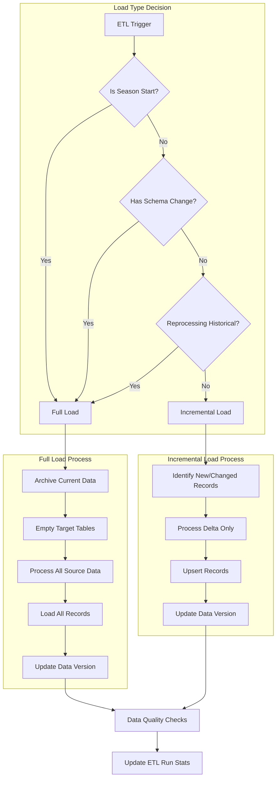

# Full vs. Incremental Loads

Why distinguish between them:

- Full loads replace entire datasets, ensuring data consistency but are resource-intensive
- Incremental loads add only new/changed data, more efficient but can miss changes if poorly designed

For NBA data, both are necessary:

- Full loads: Beginning of season, after major schema changes
- Incremental loads: Daily game updates, injury updates

