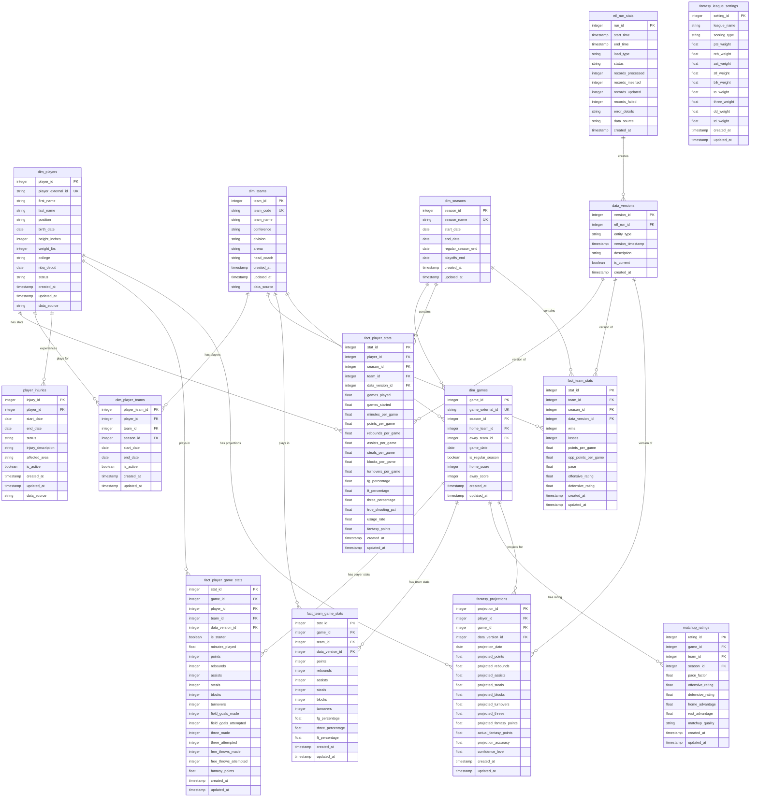

```mermaid
erDiagram
    dim_players ||--o{ fact_player_stats : "has stats"
    dim_players ||--o{ dim_player_teams : "plays for"
    dim_players ||--o{ player_injuries : "experiences"
    dim_teams ||--o{ dim_player_teams : "has players"
    dim_teams ||--o{ fact_team_stats : "has stats"
    dim_games ||--o{ fact_player_game_stats : "has player stats"
    dim_games ||--o{ fact_team_game_stats : "has team stats"
    dim_players ||--o{ fact_player_game_stats : "plays in"
    dim_teams ||--o{ fact_team_game_stats : "plays in"
    dim_teams ||--o{ dim_games : "participates"
    dim_seasons ||--o{ dim_games : "contains"
    dim_seasons ||--o{ fact_player_stats : "contains"
    dim_seasons ||--o{ fact_team_stats : "contains"
    dim_games ||--o{ matchup_ratings : "has rating"
    dim_players ||--o{ fantasy_projections : "has projections"
    dim_games ||--o{ fantasy_projections : "projects for"
    etl_run_stats ||--o{ data_versions : "creates"
    data_versions ||--o{ fact_player_stats : "version of"
    data_versions ||--o{ fact_team_stats : "version of"
    data_versions ||--o{ fantasy_projections : "version of"
    
    dim_players {
        integer player_id PK
        string player_external_id UK
        string first_name
        string last_name
        string position
        date birth_date
        integer height_inches
        integer weight_lbs
        string college
        date nba_debut
        string status
        timestamp created_at
        timestamp updated_at
        string data_source
    }
    
    dim_teams {
        integer team_id PK
        string team_code UK
        string team_name
        string conference
        string division
        string arena
        string head_coach
        timestamp created_at
        timestamp updated_at
        string data_source
    }
    
    dim_player_teams {
        integer player_team_id PK
        integer player_id FK
        integer team_id FK
        integer season_id FK
        date start_date
        date end_date
        boolean is_active
        timestamp created_at
        timestamp updated_at
    }
    
    dim_games {
        integer game_id PK
        string game_external_id UK
        integer season_id FK
        integer home_team_id FK
        integer away_team_id FK
        date game_date
        boolean is_regular_season
        integer home_score
        integer away_score
        timestamp created_at
        timestamp updated_at
    }
    
    dim_seasons {
        integer season_id PK
        string season_name UK
        date start_date
        date end_date
        date regular_season_end
        date playoffs_end
        timestamp created_at
        timestamp updated_at
    }
    
    fact_player_stats {
        integer stat_id PK
        integer player_id FK
        integer season_id FK
        integer team_id FK
        integer data_version_id FK
        float games_played
        float games_started
        float minutes_per_game
        float points_per_game
        float rebounds_per_game
        float assists_per_game
        float steals_per_game
        float blocks_per_game
        float turnovers_per_game
        float fg_percentage
        float ft_percentage
        float three_percentage
        float true_shooting_pct
        float usage_rate
        float fantasy_points
        timestamp created_at
        timestamp updated_at
    }
    
    fact_team_stats {
        integer stat_id PK
        integer team_id FK
        integer season_id FK
        integer data_version_id FK
        integer wins
        integer losses
        float points_per_game
        float opp_points_per_game
        float pace
        float offensive_rating
        float defensive_rating
        timestamp created_at
        timestamp updated_at
    }
    
    fact_player_game_stats {
        integer stat_id PK
        integer game_id FK
        integer player_id FK
        integer team_id FK
        integer data_version_id FK
        boolean is_starter
        float minutes_played
        integer points
        integer rebounds
        integer assists
        integer steals
        integer blocks
        integer turnovers
        integer field_goals_made
        integer field_goals_attempted
        integer three_made
        integer three_attempted
        integer free_throws_made
        integer free_throws_attempted
        float fantasy_points
        timestamp created_at
        timestamp updated_at
    }
    
    fact_team_game_stats {
        integer stat_id PK
        integer game_id FK
        integer team_id FK
        integer data_version_id FK
        integer points
        integer rebounds
        integer assists
        integer steals
        integer blocks
        integer turnovers
        float fg_percentage
        float three_percentage
        float ft_percentage
        timestamp created_at
        timestamp updated_at
    }
    
    player_injuries {
        integer injury_id PK
        integer player_id FK
        date start_date
        date end_date
        string status
        string injury_description
        string affected_area
        boolean is_active
        timestamp created_at
        timestamp updated_at
        string data_source
    }
    
    matchup_ratings {
        integer rating_id PK
        integer game_id FK
        integer team_id FK
        integer season_id FK
        float pace_factor
        float offensive_rating
        float defensive_rating
        float home_advantage
        float rest_advantage
        string matchup_quality
        timestamp created_at
        timestamp updated_at
    }
    
    fantasy_projections {
        integer projection_id PK
        integer player_id FK
        integer game_id FK
        integer data_version_id FK
        date projection_date
        float projected_points
        float projected_rebounds
        float projected_assists
        float projected_steals
        float projected_blocks
        float projected_turnovers
        float projected_threes
        float projected_fantasy_points
        float actual_fantasy_points
        float projection_accuracy
        float confidence_level
        timestamp created_at
        timestamp updated_at
    }
    
    etl_run_stats {
        integer run_id PK
        timestamp start_time
        timestamp end_time
        string load_type
        string status
        integer records_processed
        integer records_inserted
        integer records_updated
        integer records_failed
        string error_details
        string data_source
        timestamp created_at
    }
    
    data_versions {
        integer version_id PK
        integer etl_run_id FK
        string entity_type
        timestamp version_timestamp
        string description
        boolean is_current
        timestamp created_at
    }
    
    fantasy_league_settings {
        integer setting_id PK
        string league_name
        string scoring_type
        float pts_weight
        float reb_weight
        float ast_weight
        float stl_weight
        float blk_weight
        float to_weight
        float three_weight
        float dd_weight
        float td_weight
        timestamp created_at
        timestamp updated_at
    }
```