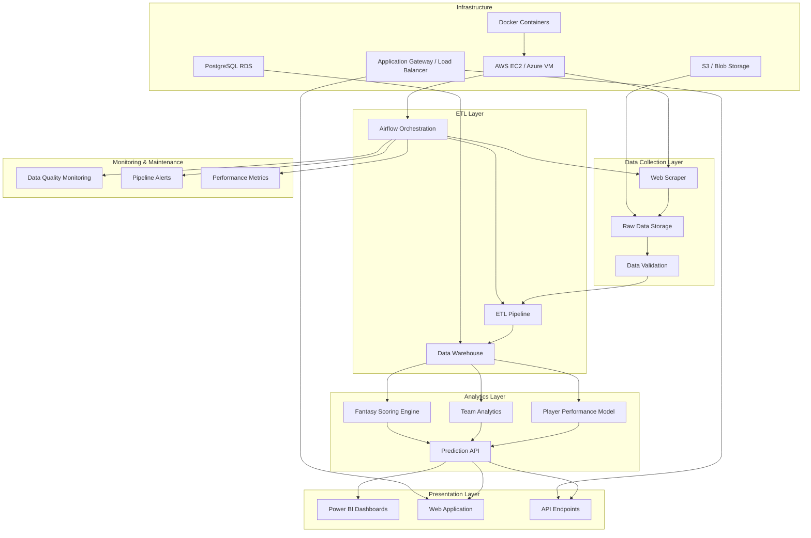

```mermaid
flowchart TD
    subgraph "Data Collection Layer"
        A[Web Scraper] --> B[Raw Data Storage]
        B --> C[Data Validation]
    end
    
    subgraph "ETL Layer"
        C --> D[ETL Pipeline]
        D --> E[Data Warehouse]
        F[Airflow Orchestration] --> A
        F --> D
    end
    
    subgraph "Analytics Layer"
        E --> G[Player Performance Model]
        E --> H[Team Analytics]
        E --> I[Fantasy Scoring Engine]
        G --> J[Prediction API]
        H --> J
        I --> J
    end
    
    subgraph "Presentation Layer"
        J --> K[Power BI Dashboards]
        J --> L[Web Application]
        J --> M[API Endpoints]
    end
    
    subgraph "Infrastructure"
        N[AWS EC2 / Azure VM] --> A
        N --> F
        O[PostgreSQL RDS] --> E
        P[S3 / Blob Storage] --> B
        Q[Docker Containers] --> N
        R[Application Gateway / Load Balancer] --> L
        R --> M
    end
    
    subgraph "Monitoring & Maintenance"
        S[Data Quality Monitoring]
        T[Pipeline Alerts]
        U[Performance Metrics]
        F --> S
        F --> T
        F --> U
    end
```