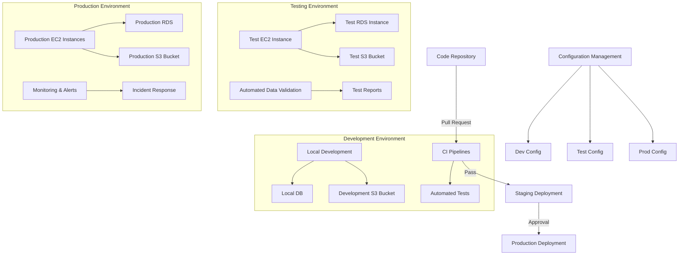

Each environment has:

- Separate infrastructure (EC2, RDS, S3)
- Environment-specific configuration
- Appropriate access controls
- Dedicated data pipeline instances

```mermaid
flowchart TD
    subgraph "Development Environment"
        A1[Local Development] --> B1[Local DB]
        A1 --> C1[Development S3 Bucket]
        D1[CI Pipelines] --> E1[Automated Tests]
    end
    
    subgraph "Testing Environment"
        A2[Test EC2 Instance] --> B2[Test RDS Instance]
        A2 --> C2[Test S3 Bucket]
        D2[Automated Data Validation] --> E2[Test Reports]
    end
    
    subgraph "Production Environment"
        A3[Production EC2 Instances] --> B3[Production RDS]
        A3 --> C3[Production S3 Bucket]
        D3[Monitoring & Alerts] --> E3[Incident Response]
    end
    
    F[Code Repository] --> |Pull Request| D1
    D1 --> |Pass| G[Staging Deployment]
    G --> |Approval| H[Production Deployment]
    
    I[Configuration Management] --> J[Dev Config]
    I --> K[Test Config]
    I --> L[Prod Config]
```