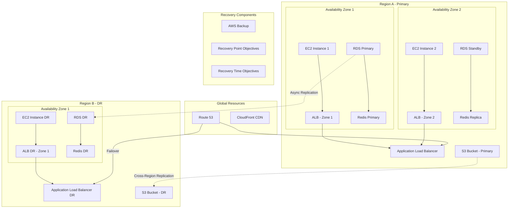

Key high availability components:

- Multi-AZ deployments for all services
- Auto-scaling for EC2 instances
- Database replication (RDS Multi-AZ)
- S3 cross-region replication for disaster recovery
- Load balancing across availability zones
- Automated failover for critical services

