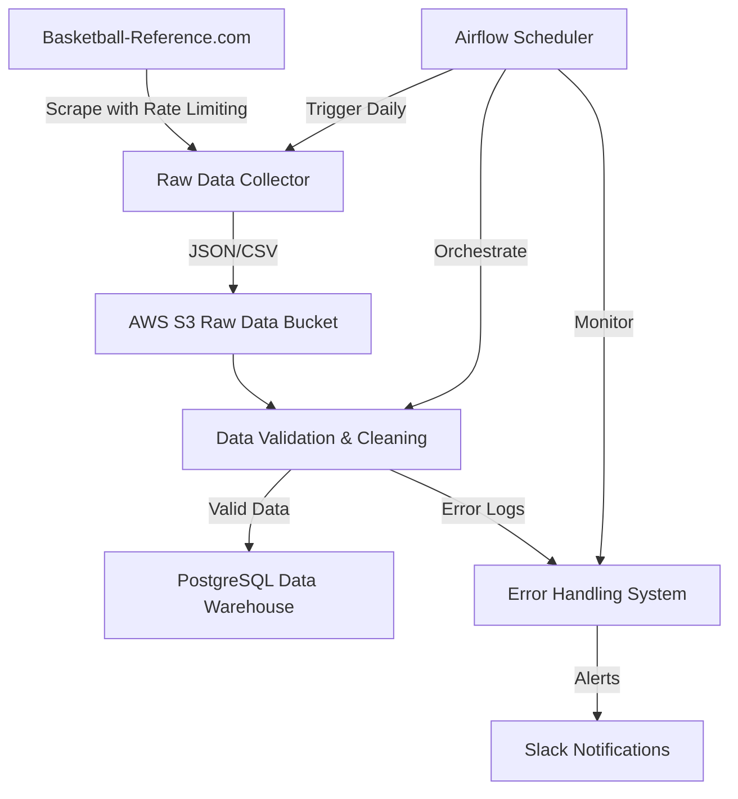

```mermaid
flowchart TD
    A[Basketball-Reference.com] --> |Scrape with Rate Limiting| B[Raw Data Collector]
    B --> |JSON/CSV| C[AWS S3 Raw Data Bucket]
    C --> D[Data Validation & Cleaning]
    D --> |Valid Data| E[PostgreSQL Data Warehouse]
    D --> |Error Logs| F[Error Handling System]
    F --> |Alerts| G[Slack Notifications]
    H[Airflow Scheduler] --> |Trigger Daily| B
    H --> |Orchestrate| D
    H --> |Monitor| F
```